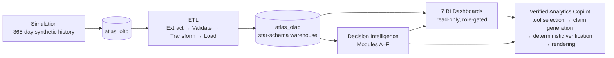
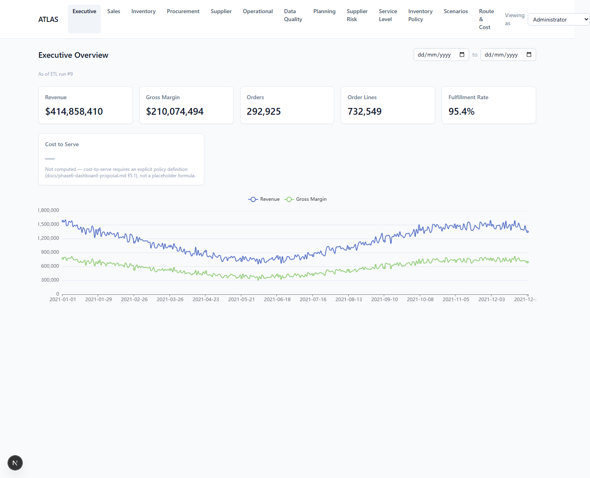
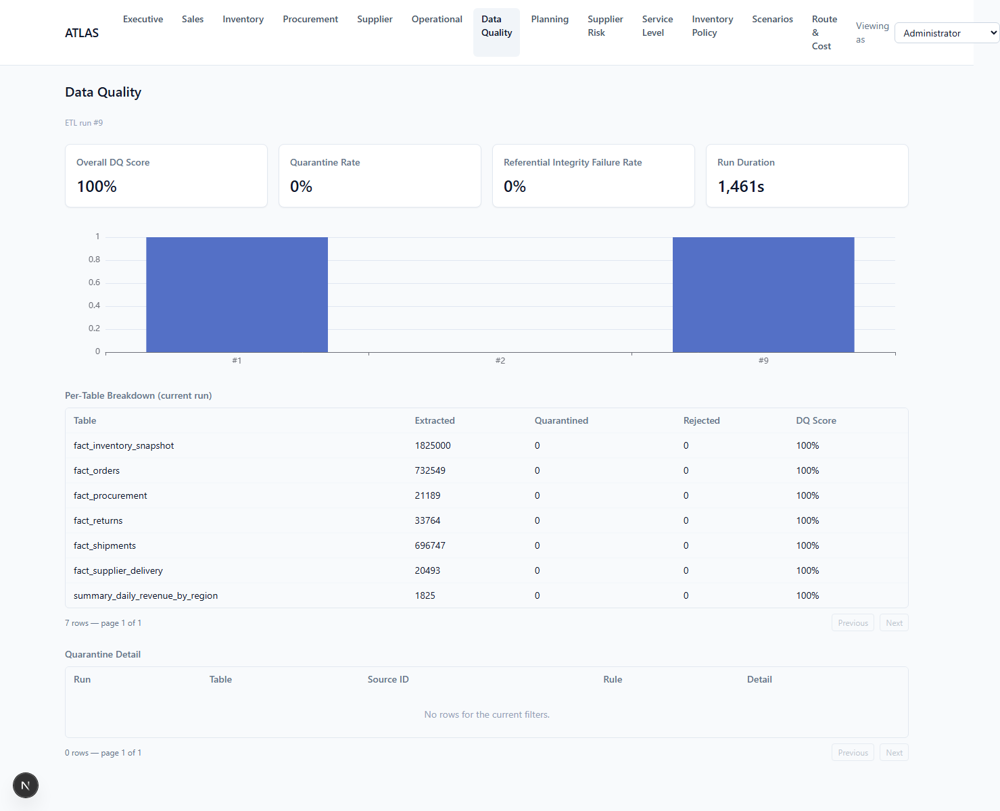
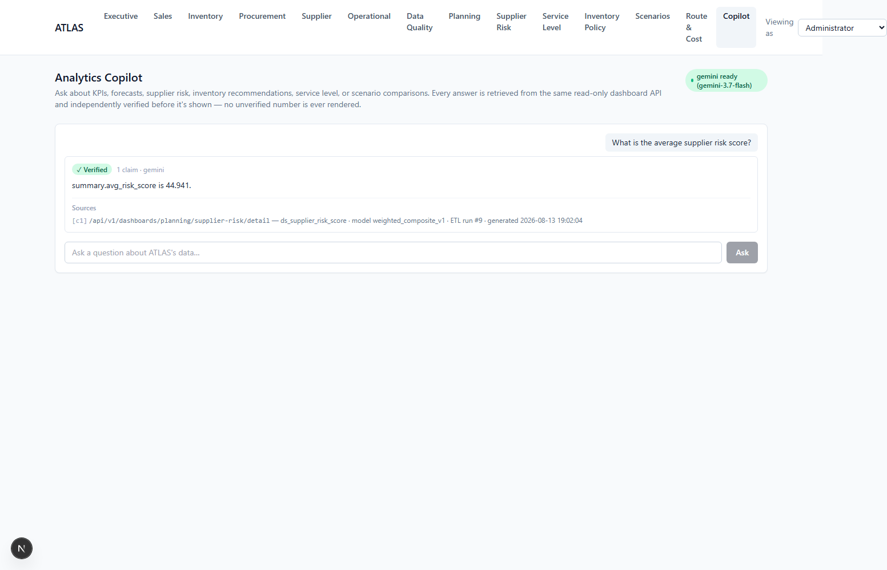

# ATLAS

## Enterprise Supply Chain Intelligence Platform — v1.0

ATLAS is an end-to-end supply-chain intelligence platform: a rule-driven simulation engine that generates a realistic transaction history, a normalized OLTP schema, an incremental ETL pipeline with a tested data-quality framework, a Kimball star-schema warehouse, seven read-only BI dashboards, six decision-intelligence modules (forecasting, supplier risk, service-level prediction, inventory optimization, scenario simulation, route/cost optimization), and a verification-first analytics copilot.

**Status: v1.0 — feature-complete.** Full write-up: [`docs/ATLAS-v1.0-final-report.md`](docs/ATLAS-v1.0-final-report.md).

---

## Architecture



System architecture, data flow, warehouse star schema, ETL pipeline, and the copilot's verification pipeline are diagrammed in [`docs/architecture-overview.md`](docs/architecture-overview.md).

## Feature summary

| Area | What it does | Headline result |
|---|---|---|
| **Simulation** | 365-day synthetic supply chain — 8 warehouses, 5,000 products, 100 suppliers, 2,000 customers, 25 carriers | 292,925 orders, 10/10 SQL invariants passed, determinism proven bit-exact |
| **OLTP + Warehouse** | Normalized transactional schema → Kimball star-schema warehouse | 14 warehouse objects, SCD2 on supplier/warehouse dimensions |
| **ETL** | Watermark-based incremental extract, DQ validation, SCD2 transform, bulk load | 3.3M+ rows loaded, 0 quarantined, idempotent reruns (3,076s → 2.1s) |
| **BI Dashboards (7)** | Executive, Sales, Inventory, Procurement, Supplier, Operational, Data Quality | Every KPI reconciled to the warehouse; read-only enforcement verified live |
| **Forecasting (Module A)** | 30-day demand forecasts, 3 grains | 24.13% MAPE vs. 33.23% baseline |
| **Supplier Intelligence (Module C)** | 0–100 composite risk score | −0.8331 correlation (risk vs. on-time rate) |
| **Service-Level Prediction (Module D)** | Stockout/backorder/delay probability | Brier 0.0291 vs. 0.0301 baseline (stockout) |
| **Inventory Optimization (Module B)** | Reorder point / safety stock (EOQ excluded by design) | 97.7–98.2% achieved service level across 3 targets |
| **Scenario Simulation (Module E)** | 13 precomputed what-if scenarios | Baseline equivalence to 10 decimal places |
| **Route/Cost Optimization (Module F)** | Vehicle right-sizing + consolidation | $47.3M estimated savings, zero service-level impact |
| **Analytics Copilot (Phase 8/8.1)** | Natural-language Q&A over the platform, answers verified before rendering | Claim-based, deterministically verified; validated live against Gemini |

Every module is closed-form and standard-library-only — no machine learning, reinforcement learning, or autonomous optimization anywhere in the platform. See [`docs/final-architecture-review.md`](docs/final-architecture-review.md) for the reasoning and the decision framework applied to any future capability along those lines.

## Screenshots

**Executive dashboard** — KPIs and revenue/margin trend, reconciled to the warehouse:



**Data Quality dashboard** — ETL run health, per-table DQ score, quarantine detail:



**Analytics Copilot** — an answer with citation, source endpoint, and model/ETL-run lineage:



## Quick start

Requirements: Docker Desktop (with Compose).

```bash
cp .env.example .env      # fill in real local values
docker compose up --build
```

- Frontend: http://localhost:3000
- Backend: http://localhost:8000/health
- MySQL: localhost:3306 (schemas `atlas_oltp`, `atlas_olap` created on first boot)

To use the Analytics Copilot, add a free [Google AI Studio](https://aistudio.google.com/apikey) key to `.env`:

```bash
GEMINI_API_KEY=your-key-here
```

The copilot page (`/copilot`) shows a "provider ready" indicator once the key is picked up (`docker compose up -d --force-recreate backend` after editing `.env` on an already-running stack).

## Technology stack

**Database**: MySQL 8, single instance, two schemas — `atlas_oltp` (transactional) and `atlas_olap` (OLAP star-schema warehouse) — with least-privilege, per-role grants: `atlas_app`, `atlas_reporting`, `atlas_decision_support`.

**Backend**: Python, FastAPI, SQLAlchemy, Alembic, Pytest. Decision-intelligence modules use only the Python standard library — no ML framework anywhere in the platform.

**Analytics Copilot**: Google Gemini (Google AI Studio) via a configuration-driven provider abstraction (`google-genai`) — the only external network dependency in the platform, confined to proposing claims that a local, deterministic verifier checks before anything renders.

**Frontend**: Next.js, React, TypeScript, Tailwind CSS, ECharts, TanStack Table.

**Infrastructure**: Docker / Docker Compose, GitHub Actions CI.

## Repository structure

```
ATLAS/
├── docker-compose.yml
├── .env.example
├── docker/mysql/init/         # first-boot schema + role creation
├── docs/
│   ├── ATLAS-*.md               # SRS / TDD / Roadmap / Master Prompt
│   ├── ATLAS-v1.0-final-report.md   # complete platform summary
│   ├── architecture-overview.md     # system/data-flow/star-schema/ETL/copilot diagrams
│   ├── final-architecture-review.md # scope decisions and the framework behind them
│   ├── phase*-completion.md         # per-phase validation reports
│   ├── phase8-*.md                  # analytics copilot: spec, verification, Gemini notes
│   ├── diagrams/                    # ERD, star schema (current); early drafts (superseded)
│   └── screenshots/
├── backend/
│   ├── app/                     # FastAPI app: core/, domains/, decision_support/, copilot/, api/
│   ├── alembic/                  # OLTP migrations
│   └── tests/                   # 300 tests: simulation, ETL, warehouse, dashboards, all 6 modules, copilot
├── simulation/                   # day-advancing simulation engine
├── etl/                          # extract → validate → transform → load → audit
└── frontend/                     # Next.js dashboards, Planning suite, and Analytics Copilot
```

## Documentation index

Every phase has its own completion report with validation numbers pulled from the running system:

- [`docs/ATLAS-v1.0-final-report.md`](docs/ATLAS-v1.0-final-report.md) — the complete summary (start here)
- [`docs/architecture-overview.md`](docs/architecture-overview.md) — diagrams: system architecture, data flow, star schema, ETL pipeline, copilot verification pipeline
- [`docs/final-architecture-review.md`](docs/final-architecture-review.md) — why the platform stops where it stops, and the decision framework for any future capability
- [`docs/phase8-copilot-architecture-diagram.md`](docs/phase8-copilot-architecture-diagram.md) — the copilot's pipeline, verification boundary highlighted
- `docs/phase3` through `docs/phase8` completion/validation reports — the phase-by-phase evidence trail
- [`docs/ATLAS-SRS.md`](docs/ATLAS-SRS.md) / [`docs/ATLAS-TDD.md`](docs/ATLAS-TDD.md) — requirements and technical design, with every architecture decision recorded as a numbered ADR in the TDD's §14
