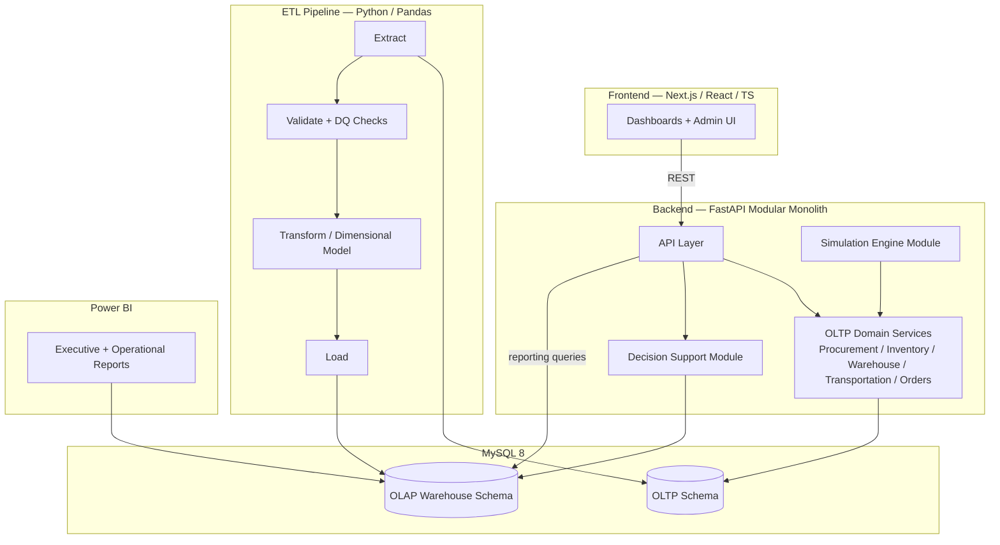
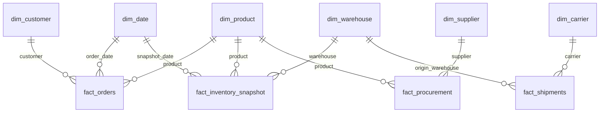
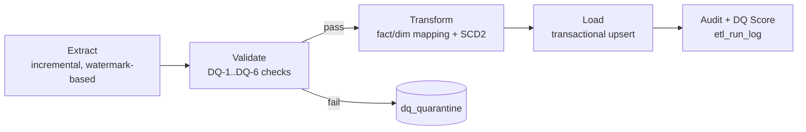

# ATLAS
## Enterprise Supply Chain Intelligence Platform
### Technical Design Document (TDD)
**Version 1.1 — Finalized**
*Source of truth: ATLAS-SRS.md v1.3 (frozen)*

---

## 1. Purpose and Scope

This document translates the frozen SRS into a concrete technical architecture: system structure, database design, ETL design, API and frontend design, security, performance, testing, and deployment strategy — plus the Architecture Decision Records that justify each major choice. MVP scope only, per the SRS Phase 1/Phase 2 split: Scenario Analysis (SRS §6.9) is referenced structurally where it affects design (so we don't paint ourselves into a corner) but is not designed in implementation detail here.

## 2. System Architecture — Overview

ATLAS is a **modular monolith**: a single deployable backend service organized into clearly bounded internal modules, backed by one MySQL 8 instance serving two logically separate schemas (OLTP and OLAP), with a separate frontend application and a scheduled ETL process. No inter-service network calls, no message broker — module boundaries are enforced in code (package/module structure, not network hops).

**Why one database instance, two schemas (not two databases/servers):** Operational simplicity for a solo-developer modular monolith; ETL reads across schema boundaries without cross-server complexity; still enforces the OLTP/OLAP separation that matters for the design story (different normalization, different access patterns, different read/write roles — see §9 Security). See ADR-001.

## 3. Component Breakdown

| Component | Responsibility | Technology |
|---|---|---|
| OLTP Domain Services | Enforce business rules and transactional integrity for procurement, inventory, warehousing, transportation, orders, returns | FastAPI + SQLAlchemy + Alembic |
| Simulation Engine | Generates realistic operational events on a schedule/trigger, calling domain services (not writing to DB directly) | Python, Faker (for realistic reference data only, not business logic) |
| ETL Pipeline | Scheduled batch process: extract → validate/DQ → transform → load → audit | Python, Pandas, NumPy |
| Decision Support Module | Reads from OLAP warehouse; computes reorder recommendations, risk alerts, route suggestions | Python, SQL, statistical libraries (no ML framework needed for MVP — see ADR-004) |
| API Layer | REST endpoints serving frontend dashboards and admin actions | FastAPI |
| Frontend | Dashboards, admin screens, role-based views | Next.js, React, TypeScript, Tailwind, shadcn/ui, ECharts, TanStack Table |
| BI Layer | Executive/operational report authoring against the warehouse, for the "professional BI tool" story separate from the custom dashboards | Power BI (connected directly to OLAP schema via a read-only reporting DB role) |

**Why both a custom frontend and Power BI, not just one:** The custom frontend demonstrates full-stack ownership of the product experience (interactive drill-downs, role-based views, decision-support workflows); Power BI demonstrates fluency with an industry-standard enterprise BI tool that many DA/BA roles use directly. They serve different interview conversations. See ADR-005.

## 4. Database Architecture

### 4.1 OLTP Schema — Design Principles
- 3NF baseline (NFR-1). Every domain from SRS §6.1–6.4 gets its own set of normalized tables: suppliers, purchase_orders, purchase_order_lines, products, warehouses, warehouse_zones, inventory_positions, inventory_transactions, carriers, shipments, shipment_events, customers, orders, order_lines, returns, return_lines.
- Surrogate integer primary keys on every table; natural/business keys (order_number, po_number, shipment_number) enforced unique separately (DQ-2).
- Foreign keys enforced at the database level (InnoDB), not just application level — this is a deliberate choice to make referential integrity a database guarantee, not just an ETL-time check. See ADR-002.
- Monetary fields use `DECIMAL(12,2)`; no `FLOAT`/`DOUBLE` for currency (NFR-4).
- Status fields (order status, shipment status, PO status) modeled as constrained enumerations (lookup tables, not free-text), enabling both integrity and clean dimensional modeling downstream.

### 4.2 OLAP Warehouse — Design Principles

Star schema, Kimball methodology. Representative (not exhaustive) design:

**Dimensions (conformed across facts where applicable):** `dim_date`, `dim_product`, `dim_supplier` (SCD Type 2 — contract terms and lead times change over time and history matters for supplier performance trend analysis), `dim_warehouse` (SCD Type 2 — capacity changes over time), `dim_carrier`, `dim_customer`, `dim_region`.

**Fact tables (distinct grains — deliberately, to demonstrate grain reasoning):**
- `fact_orders` — grain: one row per order line.
- `fact_shipments` — grain: one row per shipment.
- `fact_inventory_snapshot` — grain: one row per SKU per warehouse per day (periodic snapshot fact, not transactional — inventory levels need daily-level trend analysis, not just transaction-level detail).
- `fact_procurement` — grain: one row per purchase order line.
- `fact_supplier_delivery` — grain: one row per delivery event (feeds supplier performance/risk scoring).
- `fact_returns` — grain: one row per return line.

**Why a periodic snapshot fact for inventory instead of only transactional:** Transactional inventory movements alone make "what was inventory on day X" an expensive derived query at scale. A daily snapshot fact makes trend dashboards (stockout rate, days of supply) cheap and correct by construction — a standard, defensible Kimball pattern. See ADR-003.

#### 4.2.1 Fact Table → Business Question / KPI Mapping

Every fact table exists to answer specific business questions and power specific KPIs from SRS §15. If a fact table can't be tied to a real question, it shouldn't exist — this table is the justification.

| Fact Table | Grain | Primary Business Questions It Answers | KPIs It Powers |
|---|---|---|---|
| `fact_orders` | Order line | What are we selling, to whom, where, and when? How is demand trending by product/region/season? Are we fulfilling orders completely? | Revenue, gross margin, order volume, order fulfillment rate, cost-to-serve, forecast accuracy (as actuals baseline) |
| `fact_shipments` | Shipment | How reliably and cost-effectively are we moving goods? Which carriers/lanes underperform? | On-time delivery rate, cost per shipment/mile, carrier utilization, route efficiency |
| `fact_inventory_snapshot` | SKU × warehouse × day | How much stock do we hold, where, over time? Where are we stocking out or overstocked? How many days of supply remain? | Inventory turnover, stockout rate, days of supply, overstock value, capacity utilization |
| `fact_procurement` | PO line | What are we buying, from whom, at what cost and volume? How much is committed/in-transit? | Procurement spend, open PO value, reorder recommendation inputs |
| `fact_supplier_delivery` | Delivery event | How reliable is each supplier on time, quantity, and quality? Which suppliers are becoming a risk? | Supplier on-time %, quality rejection rate, lead-time variance, supplier risk score |
| `fact_returns` | Return line | What's coming back, why, and what's it costing us? Which products/suppliers drive returns? | Return rate, return value, quality-driven return share (feeds supplier quality metrics) |

Note the deliberate cross-fact relationships: `fact_supplier_delivery` and `fact_returns` both feed supplier quality/risk scoring; `fact_orders` (demand actuals) and `fact_inventory_snapshot` (stock position) together drive reorder recommendations. This is what makes the decision-support layer (SRS §6.8) possible — no single fact table is sufficient alone, which is itself a point worth making in an interview about why the dimensional model is designed this way.

**Why SCD Type 2 specifically on supplier and warehouse, not everything:** Applying SCD2 universally is a common student over-engineering mistake. It's justified here specifically because supplier terms/lead times and warehouse capacity genuinely change over the simulated multi-year period and historical accuracy of "what was true at the time" matters for trend and risk analysis. Product and carrier dimensions are treated as Type 1 (overwrite) for MVP since their attribute changes aren't analytically significant at this scope. See ADR-006.

### 4.3 Indexing Strategy
- Every foreign key column indexed by default (InnoDB auto-indexes FKs, but explicitly documented rather than assumed).
- Composite indexes on common dashboard filter patterns: `(warehouse_id, date_id)` on `fact_inventory_snapshot`, `(supplier_id, delivery_date)` on `fact_supplier_delivery`.
- Covering indexes considered for the highest-traffic dashboard queries once query patterns are known from FR-7.x dashboards; documented per-query in an ADR rather than speculatively indexed everywhere.

## 5. Simulation Engine Architecture

- Rule-driven, not purely random (SRS "Simulation Engine" principle). Each simulated day advances a set of business-rule generators: order generator (seasonality-aware demand curve), supplier delivery generator (lead-time distribution + occasional lateness), warehouse capacity model, transportation cost model.
- The simulation engine calls the same OLTP domain service layer the "real" API would use — it does not write to the database directly. This is deliberate: it guarantees the simulated data obeys the same business rules and constraints as any other write path, and it means the domain service layer gets exercised (and testable) independent of simulation. See ADR-007.
- Configurable via a scenario/config file for initial world-state (number of warehouses, suppliers, SKUs, base demand levels) — this same mechanism is the intended extension point for Phase 2 Scenario Analysis, without being built out for MVP.

## 6. ETL Architecture

Batch, scheduled (not streaming — per SRS constraints). Stages, each independently testable:

1. **Extract** — pulls changed OLTP rows since the last watermark per table (incremental, not full-reload, to meet NFR-8 performance targets at scale).
2. **Validate** — applies Section 7 SRS data quality rules (completeness, uniqueness, referential integrity, duplicate detection, invalid values). Failing records are written to a `dq_quarantine` table with the specific rule violated, not silently dropped (DQ-1–DQ-6).
3. **Transform** — maps OLTP rows to warehouse fact/dimension structures; applies SCD2 logic for `dim_supplier`/`dim_warehouse`; computes derived measures.
4. **Load** — upserts into OLAP schema inside a transaction per batch, so a failed load doesn't leave the warehouse partially updated (NFR-3 idempotency).
5. **Audit & Score** — every run writes to an `etl_run_log` table (timestamps, row counts per stage, error counts) and computes the data-quality score (DQ-7) surfaced on the Data Quality dashboard (FR-7.5).

**Why incremental/watermark-based rather than full reload:** Full reload is simpler to build but doesn't scale and doesn't demonstrate a realistic production pattern — incremental extraction with watermarks is the standard enterprise approach and directly supports the NFR-8 performance target. See ADR-008.

## 7. API Design

- RESTful, resource-oriented (`/api/v1/dashboards/executive`, `/api/v1/suppliers/{id}/risk`, `/api/v1/inventory/warehouse/{id}`, etc.).
- Read-heavy dashboard endpoints query the OLAP schema directly (that's what it's for); write endpoints (admin reference-data management, PO/order actions used by the simulation) go through OLTP domain services.
- Response caching considered at the API layer for expensive aggregate dashboard queries to help meet NFR-10, with cache invalidation tied to ETL run completion (dashboards only need to refresh once per ETL cycle, not per request — this is a batch-analytics system, not real-time).
- Pagination and filtering standardized across list endpoints (TanStack Table on the frontend expects this).

## 8. Frontend Architecture

- Next.js App Router; role-based route groups for Executive / Operations / Planner / Admin views per SRS actors.
- Dashboard components built on ECharts for charting, TanStack Table for tabular/drill-down views, shadcn/ui for consistent component primitives, Tailwind for styling, Framer Motion used sparingly for meaningful transitions (not decoration for its own sake — consistent with the "resembles commercial product" vision, not "flashy").
- Data fetching via typed API client generated/aligned with the FastAPI backend's schema, avoiding hand-maintained duplicate types.

## 9. Security Design

Directly implementing SRS §9:
- All queries via SQLAlchemy ORM/parameterized queries — no raw string-built SQL (SEC-1).
- Pydantic models validate all API input before it reaches business logic (SEC-2).
- Three distinct MySQL roles: `atlas_app` (read/write on OLTP schema only), `atlas_etl` (read on OLTP, read/write on OLAP), `atlas_reporting` (read-only on OLAP, used by both the API's dashboard queries and Power BI) (SEC-3).
- Credentials and connection strings via environment variables / `.env`, excluded from version control via `.gitignore`; `.env.example` committed with placeholder values (SEC-4).
- Role-based view restrictions enforced at the API layer based on the simulated actor's role (SEC-5) — implemented as a lightweight role-check middleware, not a full identity provider (per SRS assumption).

## 10. Performance Strategy

- ETL: incremental extraction (§6) plus indexed watermark columns to hit NFR-8.
- Dashboards: pre-aggregated summary tables/materialized views in the OLAP schema for the heaviest executive-level rollups (e.g. daily revenue by region), refreshed as part of the ETL load step, so NFR-9's 2-second target doesn't depend on ad-hoc aggregation over raw fact tables at query time.
- API: response caching keyed to ETL run version (§7) to hit NFR-10.
- Target data volume (deferred from SRS to here, per your decision): MVP target is a **5-year simulated history across 8 warehouses, ~5,000 SKUs, and ~100 suppliers**, generating on the order of **1–2 million order lines** and **~500,000 shipment records**, plus a daily inventory snapshot fact that at this scale reaches into the tens of millions of rows over five years (8 warehouses × ~5,000 SKUs × ~1,825 days, sparsified to active SKU/warehouse combinations). The goal is not benchmarking but ensuring the indexing strategy, incremental ETL, SCD2 handling, and pre-aggregation optimizations are all genuinely *justified* by a dataset large enough that naive approaches would visibly fail. Documented as explicit, adjustable constants, not hardcoded throughout the codebase.

> **Note on the inventory snapshot fact at this scale:** A full daily snapshot of every SKU×warehouse combination over 5 years is the single largest table in the warehouse and the main reason the snapshot-vs-transactional decision (ADR-003) and the pre-aggregation strategy matter. The design sparsifies the snapshot to active SKU/warehouse combinations (a SKU not yet stocked at a warehouse generates no snapshot rows), and partitioning of this fact by date is a documented optimization if row counts warrant it — this is exactly the kind of scale-driven design reasoning the volume target is meant to force.

## 11. Testing Strategy

- **Unit tests** (Pytest): business rule logic in OLTP domain services (e.g. BR-1 through BR-7), ETL transformation functions, data quality check functions.
- **Integration tests**: ETL pipeline end-to-end against a test database (extract → validate → transform → load → audit, verifying quarantine behavior and SCD2 correctness).
- **API tests**: FastAPI's test client against key endpoints, including role-based access checks.
- **Data quality tests**: dedicated test suite asserting each DQ-1–DQ-7 rule actually catches the bad-data case it claims to (directly addressing the SRS risk that the DQ framework could be "under-tested and give false confidence").
- CI (GitHub Actions) runs the full test suite plus linting on every push; ETL and API tests run against a containerized MySQL instance spun up in the CI job.

## 12. Deployment Strategy

- `docker-compose.yml` defines: MySQL 8 service, backend (FastAPI) service, ETL service (scheduled via a lightweight in-container scheduler — cron or APScheduler, not Airflow per SRS constraints), frontend (Next.js) service.
- Single documented `docker compose up` local setup path (Success Metric in SRS §19).
- GitHub Actions pipeline: lint → test → build images. No cloud deployment target required for MVP (out of scope per SRS §21), but the containerized design keeps a real deployment (e.g. a single VM) a small, well-understood step rather than a redesign.

## 13. Scalability Discussion

Honest framing for interviews: ATLAS is architected to *demonstrate* scalability reasoning (indexing strategy, incremental ETL, pre-aggregation, read/write role separation, snapshot fact pattern, optional date partitioning of the largest fact) at a deliberately bounded but meaningful data volume (§10 — millions of order lines, tens of millions of inventory snapshot rows) appropriate for a solo project. That volume is specifically chosen to be large enough that naive design (no indexes, query-time aggregation over raw facts, full ETL reloads) would visibly fail — so every optimization in this document is justified by a real problem, not added speculatively. The design does not require a rewrite to grow further — read replicas, connection pooling tuning, and additional query-specific materialized views are the natural next steps if volume increased by another order of magnitude — but building for a scale far beyond what a solo project can realistically generate or demonstrate would violate the "architectural quality over feature count" principle. This trade-off itself is an ADR. See ADR-009.

## 14. Architecture Decision Records (ADRs)

**ADR-001: Single MySQL instance, two schemas (not separate DB servers)**
Context: Need OLTP/OLAP separation for the design story. Decision: One instance, `atlas_oltp` and `atlas_olap` schemas. Alternative rejected: separate servers/instances — adds operational overhead disproportionate to a solo modular-monolith project without adding to the design story. Trade-off: less "realistic" multi-server isolation, but consistent with the stated modular-monolith, non-distributed constraint.

**ADR-002: Database-level foreign key enforcement in OLTP**
Decision: FKs enforced by InnoDB, not just application code. Alternative rejected: app-only enforcement (faster writes, but referential integrity becomes a hope, not a guarantee — undermines the "production-grade" objective).

**ADR-003: Periodic snapshot fact for inventory**
Decision: `fact_inventory_snapshot` (daily grain) alongside transactional facts. Alternative rejected: derive inventory-over-time purely from transaction facts at query time — technically avoids redundancy but makes common trend dashboards expensive and is a known anti-pattern Kimball explicitly warns against for exactly this use case.

**ADR-004: No ML framework for forecasting in MVP**
Decision: Statistical forecasting (e.g. moving average / exponential smoothing implemented directly in SQL or Python) rather than a full ML pipeline. Rationale: SRS explicitly prohibits generative AI and prioritizes SQL/analytics depth over ML tooling; a heavier ML framework would shift interview conversations away from the intended SQL/data-engineering focus. Revisit only if a specific role explicitly wants ML depth.

**ADR-005: Both custom frontend and Power BI**
Covered in §3. Trade-off accepted: more surface area to maintain, justified by covering two distinct interview conversations (product engineering vs. BI tooling fluency).

**ADR-006: SCD Type 2 only on supplier and warehouse dimensions**
Covered in §4.2. Rejected alternative: SCD2 everywhere (common over-engineering pattern that adds complexity without a real business justification for dimensions like product/carrier at this scope).

**ADR-007: Simulation engine writes through domain services, not directly to DB**
Covered in §5. Rejected alternative: simulation engine writes directly to tables — faster to build, but bypasses business rule enforcement and makes the domain service layer untestable in isolation from simulation.

**ADR-008: Incremental, watermark-based ETL**
Covered in §6. Rejected alternative: full nightly reload — simpler but doesn't scale and doesn't demonstrate the standard production pattern the SRS interview-value objective calls for.

**ADR-009: Bounded target data volume, not maximal scale**
Covered in §13. Rejected alternative: attempt to simulate/handle enterprise-real data volumes — unrealistic for a solo 8–12 week project and would compromise depth elsewhere in the platform to chase a scale number that can't be honestly demonstrated anyway.

**ADR-010: MySQL 8 chosen over PostgreSQL**
Context: The project charter mandates MySQL 8, but "we were told to" is not an interview-defensible answer — this ADR captures why MySQL is a *reasonable* choice for this project, and honestly where PostgreSQL would have been stronger.
Decision: Build on MySQL 8 with the InnoDB engine.
Why MySQL is a sound fit here: (1) MySQL is the most widely deployed open-source OLTP database in industry, so demonstrating depth on it — window functions, recursive CTEs (both available in MySQL 8+), stored procedures, triggers, query optimization, partitioning — is directly transferable to a large share of real DA/BA/data-engineering roles. (2) MySQL 8 closed most of the historical SQL-feature gap with PostgreSQL (CTEs, window functions, and improved optimizer all landed in 8.0), so the advanced-SQL objectives (SRS B1) are fully achievable. (3) For this workload — a well-defined OLTP schema plus a Kimball star-schema warehouse queried by aggregation-heavy dashboards — InnoDB's clustered-index storage and mature replication story are entirely adequate, and the design leans on standard SQL and dimensional modeling patterns rather than any engine-exclusive feature.
Where PostgreSQL would have been the stronger choice, stated honestly: PostgreSQL has richer analytical extensions (e.g. more advanced window-function framing, `FILTER` clauses, materialized views as a first-class feature, richer indexing like partial and expression indexes by default, and stronger support for complex analytical workloads and extensions like TimescaleDB for time-series). For a warehouse-heavy analytical platform, a from-scratch technology choice might well favor PostgreSQL.
Why that doesn't change the decision: the analytical requirements here are met by MySQL 8's feature set; the pre-aggregation strategy (§10) substitutes physical summary tables for PostgreSQL's first-class materialized views (and is arguably more instructive to build by hand for a portfolio piece); and the ubiquity of MySQL makes demonstrated mastery of it broadly marketable. The trade-off is understood and accepted, and being able to articulate *this exact comparison* — including where the chosen tool is weaker — is itself a strong interview signal.

---

## 15. Resolved Design Decisions (from review)

- **Pre-aggregated summary tables:** Confirmed as physical tables refreshed during ETL (not MySQL views). Faster dashboard queries at the target volume; the extra ETL steps are accepted.
- **Target data volume:** Confirmed at enterprise-demonstration scale — 5 years, 8 warehouses, ~5,000 SKUs, ~100 suppliers, 1–2M order lines, ~500k shipments (see §10). Chosen so every optimization is justified by a dataset large enough that naive design would fail.
- **Folder structure:** Intentionally deferred to the Development Roadmap (Document 3) and Claude Code master prompt (Document 4), not specified in the TDD.

---

*End of Document 2 (TDD) — Finalized v1.1, incorporating the enterprise-scale data volume target, the fact-table-to-business-question/KPI mapping (§4.2.1), and ADR-010 (MySQL vs PostgreSQL). Ready to proceed to Document 3 (Development Roadmap).*
