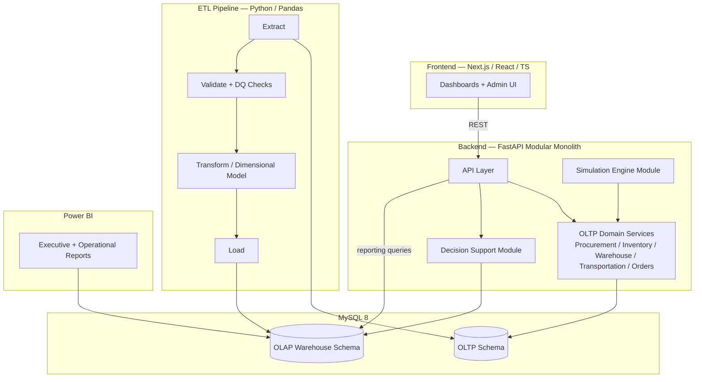
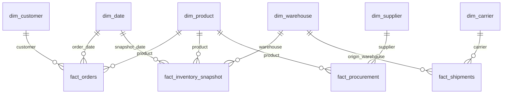
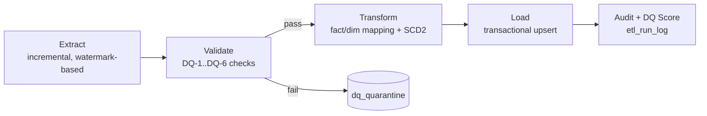

# ATLAS
## Enterprise Supply Chain Intelligence Platform
### Technical Design Document (TDD)
**Version 1.1 — Finalized**
*Source of truth: ATLAS-SRS.md v1.3 (frozen)*

---

## 1. Purpose and Scope

This document translates the frozen SRS into a concrete technical architecture: system structure, database design, ETL design, API and frontend design, security, performance, testing, and deployment strategy — plus the Architecture Decision Records that justify each major choice. MVP scope only, per the SRS Phase 1/Phase 2 split: Scenario Analysis (SRS §6.9) is referenced structurally where it affects design (so we don't paint ourselves into a corner) but is not designed in implementation detail here.

## 2. System Architecture — Overview

ATLAS is a **modular monolith**: a single deployable backend service organized into clearly bounded internal modules, backed by one MySQL 8 instance serving two logically separate schemas (OLTP and OLAP), with a separate frontend application and a scheduled ETL process. No inter-service network calls, no message broker — module boundaries are enforced in code (package/module structure, not network hops).

```mermaid
flowchart TB
    subgraph Frontend["Frontend — Next.js / React / TS"]
        UI[Dashboards + Admin UI]
    end

    subgraph Backend["Backend — FastAPI Modular Monolith"]
        API[API Layer]
        SIM[Simulation Engine Module]
        OLTP_SVC[OLTP Domain Services\nProcurement / Inventory / Warehouse / Transportation / Orders]
        DS[Decision Support Module]
    end

    subgraph ETL["ETL Pipeline — Python / Pandas"]
        EXTRACT[Extract]
        VALIDATE[Validate + DQ Checks]
        TRANSFORM[Transform / Dimensional Model]
        LOAD[Load]
    end

    subgraph DB["MySQL 8"]
        OLTP[(OLTP Schema)]
        OLAP[(OLAP Warehouse Schema)]
    end

    subgraph BI["Power BI"]
        PBI[Executive + Operational Reports]
    end

    UI -->|REST| API
    API --> OLTP_SVC
    API --> DS
    SIM --> OLTP_SVC
    OLTP_SVC --> OLTP
    DS --> OLAP
    EXTRACT --> OLTP
    EXTRACT --> VALIDATE --> TRANSFORM --> LOAD --> OLAP
    PBI --> OLAP
    API -->|reporting queries| OLAP
```

**Why one database instance, two schemas (not two databases/servers):** Operational simplicity for a solo-developer modular monolith; ETL reads across schema boundaries without cross-server complexity; still enforces the OLTP/OLAP separation that matters for the design story (different normalization, different access patterns, different read/write roles — see §9 Security). See ADR-001.

## 3. Component Breakdown

| Component | Responsibility | Technology |
|---|---|---|
| OLTP Domain Services | Enforce business rules and transactional integrity for procurement, inventory, warehousing, transportation, orders, returns | FastAPI + SQLAlchemy + Alembic |
| Simulation Engine | Generates realistic operational events on a schedule/trigger, calling domain services (not writing to DB directly) | Python, Faker (for realistic reference data only, not business logic) |
| ETL Pipeline | Scheduled batch process: extract → validate/DQ → transform → load → audit | Python, Pandas, NumPy |
| Decision Support Module | Reads from OLAP warehouse; computes reorder recommendations, risk alerts, route suggestions | Python, SQL, statistical libraries (no ML framework needed for MVP — see ADR-004) |
| API Layer | REST endpoints serving frontend dashboards and admin actions | FastAPI |
| Frontend | Dashboards, admin screens, role-based views | Next.js, React, TypeScript, Tailwind, shadcn/ui, ECharts, TanStack Table |
| BI Layer | Executive/operational report authoring against the warehouse, for the "professional BI tool" story separate from the custom dashboards | Power BI (connected directly to OLAP schema via a read-only reporting DB role) |

**Why both a custom frontend and Power BI, not just one:** The custom frontend demonstrates full-stack ownership of the product experience (interactive drill-downs, role-based views, decision-support workflows); Power BI demonstrates fluency with an industry-standard enterprise BI tool that many DA/BA roles use directly. They serve different interview conversations. See ADR-005.

## 4. Database Architecture

### 4.1 OLTP Schema — Design Principles
- 3NF baseline (NFR-1). Every domain from SRS §6.1–6.4 gets its own set of normalized tables: suppliers, purchase_orders, purchase_order_lines, products, warehouses, warehouse_zones, inventory_positions, inventory_transactions, carriers, shipments, shipment_events, customers, orders, order_lines, returns, return_lines.
- Surrogate integer primary keys on every table; natural/business keys (order_number, po_number, shipment_number) enforced unique separately (DQ-2).
- Foreign keys enforced at the database level (InnoDB), not just application level — this is a deliberate choice to make referential integrity a database guarantee, not just an ETL-time check. See ADR-002.
- Monetary fields use `DECIMAL(12,2)`; no `FLOAT`/`DOUBLE` for currency (NFR-4).
- Status fields (order status, shipment status, PO status) modeled as constrained enumerations (lookup tables, not free-text), enabling both integrity and clean dimensional modeling downstream.

### 4.2 OLAP Warehouse — Design Principles

Star schema, Kimball methodology. Representative (not exhaustive) design:

**Dimensions (conformed across facts where applicable):** `dim_date`, `dim_product`, `dim_supplier` (SCD Type 2 — contract terms and lead times change over time and history matters for supplier performance trend analysis), `dim_warehouse` (SCD Type 2 — capacity changes over time), `dim_carrier`, `dim_customer`, `dim_region`.

**Fact tables (distinct grains — deliberately, to demonstrate grain reasoning):**
- `fact_orders` — grain: one row per order line.
- `fact_shipments` — grain: one row per shipment.
- `fact_inventory_snapshot` — grain: one row per SKU per warehouse per day (periodic snapshot fact, not transactional — inventory levels need daily-level trend analysis, not just transaction-level detail).
- `fact_procurement` — grain: one row per purchase order line.
- `fact_supplier_delivery` — grain: one row per delivery event (feeds supplier performance/risk scoring).
- `fact_returns` — grain: one row per return line.

```mermaid
erDiagram
    dim_date ||--o{ fact_orders : "order_date"
    dim_product ||--o{ fact_orders : "product"
    dim_customer ||--o{ fact_orders : "customer"
    dim_warehouse ||--o{ fact_inventory_snapshot : "warehouse"
    dim_product ||--o{ fact_inventory_snapshot : "product"
    dim_date ||--o{ fact_inventory_snapshot : "snapshot_date"
    dim_supplier ||--o{ fact_procurement : "supplier"
    dim_product ||--o{ fact_procurement : "product"
    dim_carrier ||--o{ fact_shipments : "carrier"
    dim_warehouse ||--o{ fact_shipments : "origin_warehouse"
```

**Why a periodic snapshot fact for inventory instead of only transactional:** Transactional inventory movements alone make "what was inventory on day X" an expensive derived query at scale. A daily snapshot fact makes trend dashboards (stockout rate, days of supply) cheap and correct by construction — a standard, defensible Kimball pattern. See ADR-003.

#### 4.2.1 Fact Table → Business Question / KPI Mapping

Every fact table exists to answer specific business questions and power specific KPIs from SRS §15. If a fact table can't be tied to a real question, it shouldn't exist — this table is the justification.

| Fact Table | Grain | Primary Business Questions It Answers | KPIs It Powers |
|---|---|---|---|
| `fact_orders` | Order line | What are we selling, to whom, where, and when? How is demand trending by product/region/season? Are we fulfilling orders completely? | Revenue, gross margin, order volume, order fulfillment rate, cost-to-serve, forecast accuracy (as actuals baseline) |
| `fact_shipments` | Shipment | How reliably and cost-effectively are we moving goods? Which carriers/lanes underperform? | On-time delivery rate, cost per shipment/mile, carrier utilization, route efficiency |
| `fact_inventory_snapshot` | SKU × warehouse × day | How much stock do we hold, where, over time? Where are we stocking out or overstocked? How many days of supply remain? | Inventory turnover, stockout rate, days of supply, overstock value, capacity utilization |
| `fact_procurement` | PO line | What are we buying, from whom, at what cost and volume? How much is committed/in-transit? | Procurement spend, open PO value, reorder recommendation inputs |
| `fact_supplier_delivery` | Delivery event | How reliable is each supplier on time, quantity, and quality? Which suppliers are becoming a risk? | Supplier on-time %, quality rejection rate, lead-time variance, supplier risk score |
| `fact_returns` | Return line | What's coming back, why, and what's it costing us? Which products/suppliers drive returns? | Return rate, return value, quality-driven return share (feeds supplier quality metrics) |

Note the deliberate cross-fact relationships: `fact_supplier_delivery` and `fact_returns` both feed supplier quality/risk scoring; `fact_orders` (demand actuals) and `fact_inventory_snapshot` (stock position) together drive reorder recommendations. This is what makes the decision-support layer (SRS §6.8) possible — no single fact table is sufficient alone, which is itself a point worth making in an interview about why the dimensional model is designed this way.

**Why SCD Type 2 specifically on supplier and warehouse, not everything:** Applying SCD2 universally is a common student over-engineering mistake. It's justified here specifically because supplier terms/lead times and warehouse capacity genuinely change over the simulated multi-year period and historical accuracy of "what was true at the time" matters for trend and risk analysis. Product and carrier dimensions are treated as Type 1 (overwrite) for MVP since their attribute changes aren't analytically significant at this scope. See ADR-006.

### 4.3 Indexing Strategy
- Every foreign key column indexed by default (InnoDB auto-indexes FKs, but explicitly documented rather than assumed).
- Composite indexes on common dashboard filter patterns: `(warehouse_id, date_id)` on `fact_inventory_snapshot`, `(supplier_id, delivery_date)` on `fact_supplier_delivery`.
- Covering indexes considered for the highest-traffic dashboard queries once query patterns are known from FR-7.x dashboards; documented per-query in an ADR rather than speculatively indexed everywhere.

## 5. Simulation Engine Architecture

- Rule-driven, not purely random (SRS "Simulation Engine" principle). Each simulated day advances a set of business-rule generators: order generator (seasonality-aware demand curve), supplier delivery generator (lead-time distribution + occasional lateness), warehouse capacity model, transportation cost model.
- The simulation engine calls the same OLTP domain service layer the "real" API would use — it does not write to the database directly. This is deliberate: it guarantees the simulated data obeys the same business rules and constraints as any other write path, and it means the domain service layer gets exercised (and testable) independent of simulation. See ADR-007.
- Configurable via a scenario/config file for initial world-state (number of warehouses, suppliers, SKUs, base demand levels) — this same mechanism is the intended extension point for Phase 2 Scenario Analysis, without being built out for MVP.

## 6. ETL Architecture

Batch, scheduled (not streaming — per SRS constraints). Stages, each independently testable:

1. **Extract** — pulls changed OLTP rows since the last watermark per table (incremental, not full-reload, to meet NFR-8 performance targets at scale).
2. **Validate** — applies Section 7 SRS data quality rules (completeness, uniqueness, referential integrity, duplicate detection, invalid values). Failing records are written to a `dq_quarantine` table with the specific rule violated, not silently dropped (DQ-1–DQ-6).
3. **Transform** — maps OLTP rows to warehouse fact/dimension structures; applies SCD2 logic for `dim_supplier`/`dim_warehouse`; computes derived measures.
4. **Load** — upserts into OLAP schema inside a transaction per batch, so a failed load doesn't leave the warehouse partially updated (NFR-3 idempotency).
5. **Audit & Score** — every run writes to an `etl_run_log` table (timestamps, row counts per stage, error counts) and computes the data-quality score (DQ-7) surfaced on the Data Quality dashboard (FR-7.5).

```mermaid
flowchart LR
    A[Extract\nincremental, watermark-based] --> B[Validate\nDQ-1..DQ-6 checks]
    B -->|pass| C[Transform\nfact/dim mapping + SCD2]
    B -->|fail| Q[(dq_quarantine)]
    C --> D[Load\ntransactional upsert]
    D --> E[Audit + DQ Score\netl_run_log]
```

**Why incremental/watermark-based rather than full reload:** Full reload is simpler to build but doesn't scale and doesn't demonstrate a realistic production pattern — incremental extraction with watermarks is the standard enterprise approach and directly supports the NFR-8 performance target. See ADR-008.

## 7. API Design

- RESTful, resource-oriented (`/api/v1/dashboards/executive`, `/api/v1/suppliers/{id}/risk`, `/api/v1/inventory/warehouse/{id}`, etc.).
- Read-heavy dashboard endpoints query the OLAP schema directly (that's what it's for); write endpoints (admin reference-data management, PO/order actions used by the simulation) go through OLTP domain services.
- Response caching considered at the API layer for expensive aggregate dashboard queries to help meet NFR-10, with cache invalidation tied to ETL run completion (dashboards only need to refresh once per ETL cycle, not per request — this is a batch-analytics system, not real-time).
- Pagination and filtering standardized across list endpoints (TanStack Table on the frontend expects this).

## 8. Frontend Architecture

- Next.js App Router; role-based route groups for Executive / Operations / Planner / Admin views per SRS actors.
- Dashboard components built on ECharts for charting, TanStack Table for tabular/drill-down views, shadcn/ui for consistent component primitives, Tailwind for styling, Framer Motion used sparingly for meaningful transitions (not decoration for its own sake — consistent with the "resembles commercial product" vision, not "flashy").
- Data fetching via typed API client generated/aligned with the FastAPI backend's schema, avoiding hand-maintained duplicate types.

## 9. Security Design

Directly implementing SRS §9:
- All queries via SQLAlchemy ORM/parameterized queries — no raw string-built SQL (SEC-1).
- Pydantic models validate all API input before it reaches business logic (SEC-2).
- Three distinct MySQL roles: `atlas_app` (read/write on OLTP schema only), `atlas_etl` (read on OLTP, read/write on OLAP), `atlas_reporting` (read-only on OLAP, used by both the API's dashboard queries and Power BI) (SEC-3).
- Credentials and connection strings via environment variables / `.env`, excluded from version control via `.gitignore`; `.env.example` committed with placeholder values (SEC-4).
- Role-based view restrictions enforced at the API layer based on the simulated actor's role (SEC-5) — implemented as a lightweight role-check middleware, not a full identity provider (per SRS assumption).

## 10. Performance Strategy

- ETL: incremental extraction (§6) plus indexed watermark columns to hit NFR-8.
- Dashboards: pre-aggregated summary tables/materialized views in the OLAP schema for the heaviest executive-level rollups (e.g. daily revenue by region), refreshed as part of the ETL load step, so NFR-9's 2-second target doesn't depend on ad-hoc aggregation over raw fact tables at query time.
- API: response caching keyed to ETL run version (§7) to hit NFR-10.
- Target data volume (deferred from SRS to here, per your decision): MVP target is a **5-year simulated history across 8 warehouses, ~5,000 SKUs, and ~100 suppliers**, generating on the order of **1–2 million order lines** and **~500,000 shipment records**, plus a daily inventory snapshot fact that at this scale reaches into the tens of millions of rows over five years (8 warehouses × ~5,000 SKUs × ~1,825 days, sparsified to active SKU/warehouse combinations). The goal is not benchmarking but ensuring the indexing strategy, incremental ETL, SCD2 handling, and pre-aggregation optimizations are all genuinely *justified* by a dataset large enough that naive approaches would visibly fail. Documented as explicit, adjustable constants, not hardcoded throughout the codebase.

> **Note on the inventory snapshot fact at this scale:** A full daily snapshot of every SKU×warehouse combination over 5 years is the single largest table in the warehouse and the main reason the snapshot-vs-transactional decision (ADR-003) and the pre-aggregation strategy matter. The design sparsifies the snapshot to active SKU/warehouse combinations (a SKU not yet stocked at a warehouse generates no snapshot rows), and partitioning of this fact by date is a documented optimization if row counts warrant it — this is exactly the kind of scale-driven design reasoning the volume target is meant to force.

## 11. Testing Strategy

- **Unit tests** (Pytest): business rule logic in OLTP domain services (e.g. BR-1 through BR-7), ETL transformation functions, data quality check functions.
- **Integration tests**: ETL pipeline end-to-end against a test database (extract → validate → transform → load → audit, verifying quarantine behavior and SCD2 correctness).
- **API tests**: FastAPI's test client against key endpoints, including role-based access checks.
- **Data quality tests**: dedicated test suite asserting each DQ-1–DQ-7 rule actually catches the bad-data case it claims to (directly addressing the SRS risk that the DQ framework could be "under-tested and give false confidence").
- CI (GitHub Actions) runs the full test suite plus linting on every push; ETL and API tests run against a containerized MySQL instance spun up in the CI job.

## 12. Deployment Strategy

- `docker-compose.yml` defines: MySQL 8 service, backend (FastAPI) service, ETL service (scheduled via a lightweight in-container scheduler — cron or APScheduler, not Airflow per SRS constraints), frontend (Next.js) service.
- Single documented `docker compose up` local setup path (Success Metric in SRS §19).
- GitHub Actions pipeline: lint → test → build images. No cloud deployment target required for MVP (out of scope per SRS §21), but the containerized design keeps a real deployment (e.g. a single VM) a small, well-understood step rather than a redesign.

## 13. Scalability Discussion

Honest framing for interviews: ATLAS is architected to *demonstrate* scalability reasoning (indexing strategy, incremental ETL, pre-aggregation, read/write role separation, snapshot fact pattern, optional date partitioning of the largest fact) at a deliberately bounded but meaningful data volume (§10 — millions of order lines, tens of millions of inventory snapshot rows) appropriate for a solo project. That volume is specifically chosen to be large enough that naive design (no indexes, query-time aggregation over raw facts, full ETL reloads) would visibly fail — so every optimization in this document is justified by a real problem, not added speculatively. The design does not require a rewrite to grow further — read replicas, connection pooling tuning, and additional query-specific materialized views are the natural next steps if volume increased by another order of magnitude — but building for a scale far beyond what a solo project can realistically generate or demonstrate would violate the "architectural quality over feature count" principle. This trade-off itself is an ADR. See ADR-009.

## 14. Architecture Decision Records (ADRs)

**ADR-001: Single MySQL instance, two schemas (not separate DB servers)**
Context: Need OLTP/OLAP separation for the design story. Decision: One instance, `atlas_oltp` and `atlas_olap` schemas. Alternative rejected: separate servers/instances — adds operational overhead disproportionate to a solo modular-monolith project without adding to the design story. Trade-off: less "realistic" multi-server isolation, but consistent with the stated modular-monolith, non-distributed constraint.

**ADR-002: Database-level foreign key enforcement in OLTP**
Decision: FKs enforced by InnoDB, not just application code. Alternative rejected: app-only enforcement (faster writes, but referential integrity becomes a hope, not a guarantee — undermines the "production-grade" objective).

**ADR-003: Periodic snapshot fact for inventory**
Decision: `fact_inventory_snapshot` (daily grain) alongside transactional facts. Alternative rejected: derive inventory-over-time purely from transaction facts at query time — technically avoids redundancy but makes common trend dashboards expensive and is a known anti-pattern Kimball explicitly warns against for exactly this use case.

**ADR-004: No ML framework for forecasting in MVP**
Decision: Statistical forecasting (e.g. moving average / exponential smoothing implemented directly in SQL or Python) rather than a full ML pipeline. Rationale: SRS explicitly prohibits generative AI and prioritizes SQL/analytics depth over ML tooling; a heavier ML framework would shift interview conversations away from the intended SQL/data-engineering focus. Revisit only if a specific role explicitly wants ML depth.

**ADR-005: Both custom frontend and Power BI**
Covered in §3. Trade-off accepted: more surface area to maintain, justified by covering two distinct interview conversations (product engineering vs. BI tooling fluency).

**ADR-006: SCD Type 2 only on supplier and warehouse dimensions**
Covered in §4.2. Rejected alternative: SCD2 everywhere (common over-engineering pattern that adds complexity without a real business justification for dimensions like product/carrier at this scope).

**ADR-007: Simulation engine writes through domain services, not directly to DB**
Covered in §5. Rejected alternative: simulation engine writes directly to tables — faster to build, but bypasses business rule enforcement and makes the domain service layer untestable in isolation from simulation.

**ADR-008: Incremental, watermark-based ETL**
Covered in §6. Rejected alternative: full nightly reload — simpler but doesn't scale and doesn't demonstrate the standard production pattern the SRS interview-value objective calls for.

**ADR-009: Bounded target data volume, not maximal scale**
Covered in §13. Rejected alternative: attempt to simulate/handle enterprise-real data volumes — unrealistic for a solo 8–12 week project and would compromise depth elsewhere in the platform to chase a scale number that can't be honestly demonstrated anyway.

**ADR-010: MySQL 8 chosen over PostgreSQL**
Context: The project charter mandates MySQL 8, but "we were told to" is not an interview-defensible answer — this ADR captures why MySQL is a *reasonable* choice for this project, and honestly where PostgreSQL would have been stronger.
Decision: Build on MySQL 8 with the InnoDB engine.
Why MySQL is a sound fit here: (1) MySQL is the most widely deployed open-source OLTP database in industry, so demonstrating depth on it — window functions, recursive CTEs (both available in MySQL 8+), stored procedures, triggers, query optimization, partitioning — is directly transferable to a large share of real DA/BA/data-engineering roles. (2) MySQL 8 closed most of the historical SQL-feature gap with PostgreSQL (CTEs, window functions, and improved optimizer all landed in 8.0), so the advanced-SQL objectives (SRS B1) are fully achievable. (3) For this workload — a well-defined OLTP schema plus a Kimball star-schema warehouse queried by aggregation-heavy dashboards — InnoDB's clustered-index storage and mature replication story are entirely adequate, and the design leans on standard SQL and dimensional modeling patterns rather than any engine-exclusive feature.
Where PostgreSQL would have been the stronger choice, stated honestly: PostgreSQL has richer analytical extensions (e.g. more advanced window-function framing, `FILTER` clauses, materialized views as a first-class feature, richer indexing like partial and expression indexes by default, and stronger support for complex analytical workloads and extensions like TimescaleDB for time-series). For a warehouse-heavy analytical platform, a from-scratch technology choice might well favor PostgreSQL.
Why that doesn't change the decision: the analytical requirements here are met by MySQL 8's feature set; the pre-aggregation strategy (§10) substitutes physical summary tables for PostgreSQL's first-class materialized views (and is arguably more instructive to build by hand for a portfolio piece); and the ubiquity of MySQL makes demonstrated mastery of it broadly marketable. The trade-off is understood and accepted, and being able to articulate *this exact comparison* — including where the chosen tool is weaker — is itself a strong interview signal.

**ADR-011: Kimball surrogate key on all 7 OLAP dimensions, not just the two SCD2 ones**
Context: §4.2 mandates SCD2 (and therefore a surrogate key distinct from the OLTP `id`) on `dim_supplier`/`dim_warehouse`, but is silent on whether the other 5 dimensions should follow the same convention or simply reuse the OLTP `id` as their primary key. Decision: every dimension — `dim_date`, `dim_region`, `dim_product`, `dim_supplier`, `dim_warehouse`, `dim_carrier`, `dim_customer` — gets a Kimball `<dim>_key` (`INT AUTO_INCREMENT PK`; `dim_date` uses `YYYYMMDD` instead), with the OLTP `id` retained as a plain attribute. Alternative rejected: surrogate keys only on the two SCD2 dimensions, OLTP `id` reused as PK everywhere else — technically sufficient (SCD2 is the only case where reusing `id` is *impossible*), but leaves every fact table with two different FK patterns depending on which dimension it's joining, and forces Phase 5's ETL to special-case surrogate-key lookup logic for 2 of 7 dimensions instead of applying one uniform rule. The uniform convention costs nothing at this scale and removes a class of Phase 5 bugs.

**ADR-012: SCD2 column convention and its MySQL enforcement limitation**
Context: §4.2/ADR-006 mandates SCD Type 2 on `dim_supplier`/`dim_warehouse` but doesn't specify the tracking-column mechanics. Decision: `effective_from DATE NOT NULL`, `effective_to DATE NULL`, `is_current TINYINT(1) NOT NULL`, with `UNIQUE(source_id, effective_from)` — the standard Kimball convention. Documented limitation, not silently assumed away: MySQL 8 has no partial/filtered unique index, so "exactly one `is_current = 1` row per natural key" cannot be enforced at the database level the way a check like `UNIQUE(source_id) WHERE is_current` would in PostgreSQL — it is an ETL-load invariant (Phase 5's responsibility), not a DDL constraint. This is the same class of honest trade-off already named in ADR-010 for choosing MySQL over PostgreSQL.

**ADR-013: `fact_supplier_delivery` / `fact_procurement` dimension design and their shared source**
Context: §4.2's ER diagram wires `fact_orders`, `fact_inventory_snapshot`, and `fact_procurement` to dimensions explicitly, but leaves `fact_supplier_delivery` and `fact_returns` completely unspecified — no FK links are named for either. Decision: `fact_supplier_delivery` links `dim_supplier`, `dim_product`, `dim_warehouse` (the receiving DC), and two `dim_date` roles (`delivery_date_key` — NOT NULL, since a delivery event without a date isn't an event — and `expected_delivery_date_key`, needed for lead-time variance); `fact_returns` links `dim_product`, `dim_customer`, `dim_date`, all derived from real, existing OLTP columns rather than invented. Both facts are sourced 1:1 from `atlas_oltp.purchase_order_lines` and `atlas_oltp.return_lines`/`orders` respectively — no new OLTP tables were added to support this. Worth stating explicitly: `fact_procurement` (the purchase-order event — what was ordered) and `fact_supplier_delivery` (the receipt/delivery event — what arrived) share the same source table and natural key (`source_po_line_id`) because OLTP has no separate delivery-event table ("a PO line's receipt IS the delivery event," per the data dictionary). Two fact tables legitimately representing two different business processes over the same source rows is standard Kimball practice, not a modeling error — but it is easy to misread from §4.2's "distinct grains" framing alone, hence documenting it here rather than letting it be discovered as a surprise in Phase 5.

**ADR-014: `fact_inventory_snapshot` date-partitioning deferred**
Context: §10 names date-partitioning of `fact_inventory_snapshot` as an optional optimization "if row counts warrant it," sized against a 5-year simulation assumption reaching "tens of millions of rows." Decision: not implemented in Phase 4. The actual Phase 3 dataset (`docs/phase3-validation.md`) is 365 days, not 5 years — at that scale, even unsparsified, `fact_inventory_snapshot` is nowhere near the volume the original estimate assumed would justify partitioning. Alternative rejected: partition anyway, preemptively — would demonstrate the mechanic but contradicts §10's own stated condition ("if row counts warrant it"), and TDD §4.3 sets the same precedent for covering indexes (deferred until real numbers/query patterns justify them, not spec'd speculatively). Revisit if a future phase generates a larger dataset.

**ADR-015: ETL metadata tables (`etl_watermark`, `etl_extract_staging`, `dq_quarantine`, `etl_run_log`, `etl_run_table_metrics`) live in `atlas_olap`**
*Context:* §6's ETL stages need somewhere durable to persist process state between runs (last watermark per table), staged-but-not-yet-loaded rows, quarantined records, and audit/observability output — none of this is warehouse *content* (facts/dimensions), but the pipeline still has to write it somewhere, and the TDD never names a location.
*Decision:* All five tables live in `atlas_olap`, alongside the warehouse they serve.
*Rationale:* The Master Prompt's own communication matrix (§3) states the ETL pipeline has **read** access to `atlas_oltp` and **write** access to `atlas_olap` only — it cannot write to `atlas_oltp` under any circumstance. Since every one of these tables is written by the ETL process itself, `atlas_oltp` is not an option; `atlas_olap` is the only schema consistent with the already-frozen role separation.
*Alternatives considered:* (a) A third schema (e.g. `atlas_etl_meta`) — rejected: ADR-001 already froze the two-schema design ("one instance, `atlas_oltp` and `atlas_olap` schemas") specifically to avoid schema proliferation beyond what the OLTP/OLAP story requires; a third schema for process metadata isn't justified by anything in the frozen spec and would need its own ADR to introduce. (b) Store watermarks/audit state in application-level files instead of a DB table — rejected: not queryable by SQL (undermining the DQ dashboard's "per-table data quality score... tracked over time" requirement, FR-7.5), and not consistent with "transactional and idempotent" loading (NFR-3) if the watermark and the data it gates can fall out of sync across a file/DB boundary.
*Consequences:* These tables are pure process metadata, not modeled as warehouse facts/dimensions and not part of the star schema — they don't appear in `docs/diagrams/star-schema.md`. They get their own short section in `docs/data-dictionary.md` instead. `atlas_olap` now holds two kinds of tables (warehouse content + ETL process metadata) sharing one schema, which is a minor departure from a "pure" Kimball warehouse but avoids inventing a third schema the frozen spec doesn't call for.

**ADR-016: Deterministic SCD2 versioning and same-day tie-breaking**
*Context:* TDD §4.2/ADR-006 mandates SCD2 on `dim_supplier`/`dim_warehouse`; ADR-012 (Phase 4) fixed the column convention (`effective_from`/`effective_to`/`is_current`, `effective_from` as `DATE`) but Phase 4 didn't need to decide *what value* `effective_from` takes or what happens when two changes to the same natural key would compute the same `effective_from`. Phase 5 does.
*Decision:* `effective_from` for a new dimension version is always the source OLTP row's `updated_at` **date** — never the ETL run's wall-clock time. If a newly computed `effective_from` for a natural key equals its current version's own `effective_from` (a second real change on the same calendar day, possible since Phase 5 can run more than once a day), that current version is updated **in place** rather than versioned again — history granularity is one version per natural key per calendar day.
*Rationale:* Wall-clock-based `effective_from` would make every rebuild produce different dimension history depending on when it happened, directly violating the explicit requirement that a rebuild from the same OLTP data be deterministic. Source `updated_at` is stable across any number of reruns. The same-day coalescing rule is required because `effective_from`'s schema is `DATE`, not `DATETIME` (a frozen Phase 4 decision, not reopened here) — without a tie-break rule, two same-day changes would collide on `UNIQUE(source_id, effective_from)` and the second would fail to load.
*Alternatives considered:* (a) Widen `effective_from` to `DATETIME` for finer-grained tie-breaking — rejected: changes the already-approved Phase 4 warehouse schema, which this phase was explicitly told not to touch. (b) Append a sequence/version suffix to disambiguate same-day changes as separate rows — rejected: breaks the `UNIQUE(source_id, effective_from)` constraint's meaning (it would need a third key component, again touching Phase 4 schema) and adds complexity for a scenario ("multiple real business changes to the same supplier's terms within one calendar day") that has no evidence of occurring in the actual simulated dataset. (c) Reject/error on same-day collision instead of coalescing — rejected: would make the pipeline non-idempotent in a realistic scenario (a legitimate second same-day change), turning a normal case into a hard failure.
*Consequences:* SCD2 history in this warehouse has day-level granularity, not intra-day granularity — if a supplier's terms genuinely changed twice in one day, only the final state of that day survives as a distinct version. This is a standard, accepted limitation for batch/incremental (not continuously streaming) warehouses, consistent with TDD §6's own "batch, scheduled (not streaming)" framing, and is documented here rather than discovered as a surprise.

*Addendum (discovered during Stage B implementation, against the real dataset):* The decision above assumed OLTP `updated_at` tracks *business-time* change. Against the real simulated dataset, it does not for `suppliers`/`warehouses`: their `created_at`/`updated_at` are stamped at data-generation/load wall-clock time (e.g. `2026-08-08`), not at any simulated-business-time event — these two dimensions are static reference data that never actually changes during the simulation, so every natural id has exactly one version, dated to whenever the seed data was written into MySQL. Applying the ADR-016 rule literally to a dimension's *first* version made every one of them dated `2026-08-08`, which is later than every fact business date in the dataset (2021 onward) — so `resolve_scd2_as_of` (ADR-021) could never find a covering version, and 100% of `fact_procurement` rows quarantined on DQ-3 on first real-data run. **Fix:** a dimension's first-ever version (no prior current row) is dated to a fixed epoch sentinel (`2000-01-01`, safely before the dataset's earliest possible business date) instead of `source_updated_at`. A *genuine* subsequent change (a current row already exists and a tracked attribute differs) still versions off `source_updated_at`, unchanged from the original decision — the addendum narrows the rule to where it's actually justified (a real observed change) rather than widening or reversing it. The sentinel is a fixed constant, not wall-clock `now()`, so this stays fully deterministic across reruns. The two already-loaded dimensions were corrected in place (`effective_from` updated to the sentinel for their single existing version) rather than truncated and reloaded, since `fact_orders`/`fact_shipments` already carry FK references to their surrogate keys and a truncate would either violate that constraint or risk regenerating different keys.

**ADR-017: Watermark advancement semantics**
*Context:* TDD §6/ADR-008 says extraction is "incremental, watermark-based," but doesn't define precisely when the watermark is allowed to move forward — a naive implementation (advance to the extraction query's cutoff timestamp, e.g. "now()") has a known failure mode.
*Decision:* `etl_watermark.last_extracted_at` for a table advances only to the maximum `updated_at` among rows from that batch that are **durably accounted for** — written to `etl_extract_staging` (accepted) or `dq_quarantine` (quarantined) — never to the extraction cutoff timestamp itself, and never past a row that hasn't yet been durably recorded somewhere.
*Rationale:* If extraction used `WHERE updated_at > watermark AND updated_at <= now()` and advanced the watermark to `now()` unconditionally, a row that existed in OLTP within that window but wasn't yet visible to the extraction query (an ordinary commit-timing race, not a bug) would be silently skipped forever, since the next run's watermark would already be past it. Tying advancement to what was actually captured — not to wall-clock time — eliminates that failure mode by construction, and is exactly why `etl_extract_staging` (ADR-015) exists: Stage A has no Load stage yet to be the "durable" endpoint, so accepted rows need their own durable home before it's safe to move the watermark past them.
*Alternatives considered:* (a) Advance to the extraction cutoff timestamp — rejected for the race-condition reason above; this is the standard, well-known anti-pattern the decision avoids. (b) Advance only after full Load (Stage B) — rejected as the *permanent* rule (it's actually where this design is headed once Stage B exists and runs in the same pass as Stage A), but unworkable as an *interim* rule while only Stage A exists: without an interim durable point, either the watermark never advances (breaking the explicit "no-change rerun produces no additional extracted rows" requirement) or accepted rows would be silently lost if the watermark advanced past them without being recorded anywhere.
*Consequences:* A quarantined row's timestamp is treated as "accounted for" the moment it's quarantined — the watermark advances past it even though it was never loaded. This is intentional: quarantine is a terminal, logged outcome (BR-6), not a pending-retry state. A row is not automatically retried just because time passes; it's retried only if its OLTP source row changes again (bumping `updated_at` forward past the current watermark).

**ADR-018: Idempotent per-table transaction model**
*Context:* NFR-3 requires ETL jobs to be idempotent and re-runnable without corruption; TDD §6 additionally requires the Load stage to upsert "inside a transaction per batch, so a failed load doesn't leave the warehouse partially updated." Phase 3's own history is directly relevant here: a single, ever-growing transaction across an entire multi-hour run was a real, measured bug (throughput degrading from ~178 rows/sec to ~61 rows/sec past ~1.5M modified rows), fixed by committing periodically instead.
*Decision:* One transaction per table per run (chunked further internally for very large tables), not one transaction for an entire pipeline run.
*Rationale:* Because every write in this design is an idempotent upsert keyed on a real `UNIQUE` constraint (grain key for facts, natural-id or `(natural_id, effective_from)` for dimensions), a failure partway through a run is safe to leave as-is: already-committed tables are correct and won't be corrupted by a later failure, and a rerun reproduces identical rows for them (a true no-op) while continuing past the point of failure for the rest. Committing per table (not one giant transaction) avoids re-introducing Phase 3's exact proven degradation pattern at this data volume, and keeps each unit of work small enough that MySQL's transaction log/lock footprint stays bounded.
*Alternatives considered:* (a) One transaction for the whole run — rejected: technically the most literal reading of "a failed load doesn't leave the warehouse partially updated," but reintroduces the Phase 3 growing-transaction bug, and at real data volume (hundreds of thousands to low millions of rows across a full run) risks a multi-hour uncommitted transaction. (b) One transaction per row — rejected: correct but far too slow (network round-trip and commit overhead per row) to meet NFR-8's batch-window target. Per-table (internally batched) is the middle ground already proven correct and performant in Phase 3's bulk domain services.
*Consequences:* "Transactional and idempotent" (NFR-3) is satisfied at per-table-batch granularity, not by one all-or-nothing multi-hour transaction. A crash mid-run leaves some tables fully updated and others untouched for this run — by design, and safe, because the watermark (ADR-017) accurately reflects exactly that split, and a rerun self-heals it.

**ADR-019: Quarantine-first late-arriving-dimension strategy**
*Context:* A classic ETL problem: a fact record can reference a dimension entity (e.g. a new supplier) that hasn't been loaded into the warehouse yet. Kimball's standard answer is an "inferred member" — a placeholder dimension row created on the fly so the fact can load, later backfilled with real attributes when the dimension catches up.
*Decision:* No inferred-member/placeholder-row mechanism is built. Instead: (1) within one pipeline run, dimensions are always extracted and loaded using the same batch watermark cutoff as facts, and always complete before any fact is processed, so any dimension a same-batch fact could reference is already present; (2) the residual case — a fact referencing something that still doesn't resolve — is caught by DQ-3 (referential integrity) and quarantined with the specific unresolved reference and business date recorded, not loaded with a placeholder or dropped silently.
*Rationale:* The same-batch-watermark-plus-ordering rule eliminates true late arrival by construction for the overwhelming majority of cases — it isn't a heuristic, it's a structural guarantee given this pipeline's batch/incremental design (not continuously streaming, per TDD §6). The residual case this can't prevent (e.g. a genuine data-integrity problem in the source) is exactly what DQ-3 and quarantine already exist to handle, so no new mechanism is needed for it.
*Alternatives considered:* Kimball's inferred-member pattern — rejected: it solves a problem (a continuously streaming or loosely-ordered pipeline where a fact can genuinely arrive before its dimension) that this design doesn't have, given the ordering guarantee above. Building it anyway would add real, ongoing complexity — a placeholder row to track, detect, and correctly backfill later — for a scenario reduced to a rare edge case by the architecture already in place. Quarantine-and-retry-on-the-next-run is simpler, reuses machinery Stage A already builds for DQ-3, and is fully sufficient for the residual case.
*Consequences:* A fact whose dimension is missing for a structural reason (not just ordering) will sit in `dq_quarantine` until its source data changes — it is not auto-corrected by a later run unless the underlying OLTP row itself is touched again. This is consistent with ADR-017's treatment of quarantine as a terminal, logged outcome, not a silently-retried one.

**ADR-020: `fact_inventory_snapshot` source extraction and transform mechanics**
*Context:* Stage A's original 13-table extraction registry (built before Stage B's fact-by-fact needs were worked out in full detail) did not include `inventory_positions`/`inventory_transactions` — `fact_inventory_snapshot`'s only real source. `inventory_positions` in OLTP is current-state only (one row per product × warehouse × zone); there is no historical inventory table to reconstruct "what did inventory look like on day X" directly.
*Decision:* Both tables are added to the extraction registry (running through the identical extract/validate/stage machinery as every other table, for watermark tracking and DQ coverage — not a special case there). The transform's actual window-function computation, however, queries `atlas_oltp.inventory_transactions`/`inventory_positions` **directly** rather than the JSON-staged snapshot in `etl_extract_staging` — `SUM(quantity_delta) OVER (PARTITION BY product_id, warehouse_id ORDER BY day)`, rolled up from zone-level `inventory_positions` to the warehouse level (the fact's stated grain, `docs/data-dictionary.md`), recomputing the full cumulative history every run. This is a deliberate, narrow exception to "transform reads from staging, never live OLTP again" (the general rule everywhere else in Stage B): `inventory_transactions` is documented as an **append-only ledger** (`docs/data-dictionary.md`) — rows are never updated or deleted in OLTP, so anything Stage A already validated and staged is guaranteed to still be present, unchanged, in live OLTP. The concern the general rule guards against (OLTP mutating a row between extract and transform) cannot happen here by the source table's own nature.
*Rationale:* A window function is the correct, set-based way to compute a running balance in SQL (and is explicitly the kind of MySQL 8 capability ADR-010 cites as justifying the platform choice) — running it against real relational columns is simple and fast; running the equivalent computation against `etl_extract_staging`'s JSON payloads would require `JSON_TABLE`-based extraction with materially more complexity for no correctness benefit, given the append-only guarantee above. Recomputing full history every run — rather than carrying forward a stored "prior balance" checkpoint between runs — avoids reintroducing the stateful-resume fragility this whole design otherwise avoids (ADR-017's watermark rule and ADR-018's per-table transactions both lean on every write being independently correct, not dependent on a fragile running total). At the real measured scale (745,763 `inventory_transactions` rows for the full 365-day dataset), a full recompute is cheap enough that the simpler, always-correct approach costs nothing.
*Alternatives considered:* (a) Leave `fact_inventory_snapshot` unpopulated in this pass — rejected: it is one of the 6 facts explicitly in Stage B's scope, and its own DDL comment (Phase 4) already documents the window-function approach as the intended mechanism. (b) Store a running-balance checkpoint per (product, warehouse) between runs — rejected for the fragility reason above, revisit only if data volume grows enough that full recompute becomes genuinely expensive (it does not at real current scale).
*Consequences:* `fact_inventory_snapshot`'s load reflects the full recomputed history every run, not just an incremental delta — its row count is `(distinct product, warehouse pairs) × (days with any activity)`, not tied to how many `inventory_transactions` rows were extracted in a given incremental batch.

**ADR-021: Surrogate key resolution strategy**
*Context:* Every fact FKs to a dimension via its Kimball surrogate key (`<dim>_key`, ADR-011), not the OLTP natural id — Stage B's transform has to resolve natural id → surrogate key for every fact row, differently for Type 1 vs. SCD2 dimensions.
*Decision:* Type 1 dimensions (`dim_region`, `dim_product`, `dim_carrier`, `dim_customer`): direct lookup, `natural_id → <dim>_key`, bulk-fetched once per batch into an in-memory dict (not queried per row). SCD2 dimensions (`dim_supplier`, `dim_warehouse`): temporal lookup — the version whose `[effective_from, effective_to)` range covers the fact's own business date (`order_date` for procurement, `delivery_date` for supplier delivery), not unconditionally the current (`is_current = 1`) version. `dim_date`: no DB lookup at all — `date_key` is computed directly from the business date via the same `YYYYMMDD` formula `01_dim_date.sql` uses to generate the dimension, since the two are guaranteed to agree by construction.
*Rationale:* This is the literal operational meaning of "SCD2-resolved as of X date," already written into the Phase 4 fact DDL comments — a fact loaded for a date after a supplier's terms changed must resolve to the *new* version's surrogate key, and one loaded for a date before must resolve to the *old* version's, even when both are transformed in the same batch. Bulk-fetching Type 1 lookups once per batch (rather than per row) mirrors the exact bulk-fetch-then-compare pattern already proven in Phase 3's domain services and Stage A's own FK-validation lookups.
*Alternatives considered:* Always resolving to the current SCD2 version regardless of the fact's business date — rejected: would be simpler but silently wrong for any fact loaded for a date before a tracked-attribute change, which is exactly the scenario SCD2 exists to get right; TDD ADR-006 justifies SCD2 specifically for "historical accuracy of what was true at the time," and always-current resolution would defeat that.
*Consequences:* A resolution failure (no dimension row exists for that natural id, or no SCD2 version's range covers the business date) is a DQ-3 referential-integrity violation — the fact row quarantines with the specific unresolved reference and business date recorded (ADR-019), not silently loaded against the wrong version or a null key.

**ADR-022: `etl_run_table_metrics` extended with per-stage timing**
*Context:* Stage A's `duration_seconds` covered its one combined extract-and-validate step. Stage B introduces genuinely separate stages (transform, load, reconciliation) that the review process requires reported individually — extraction time, transform time, load time, reconciliation time, and total pipeline time, per milestone.
*Decision:* `etl_run_table_metrics` gains four columns: `extract_seconds`, `transform_seconds`, `load_seconds`, `reconcile_seconds` (nullable — a given run may not exercise every stage for every table, e.g. Stage-A-only historical rows). `duration_seconds` is kept as the row's total (sum of whichever stage columns are populated) rather than removed, so Stage A's existing rows and tests remain valid without a data migration.
*Rationale:* Additive, backward-compatible schema change — existing Stage A rows simply have `NULL` in the four new columns and an unchanged `duration_seconds`. Storing per-stage timing directly in the audit table (rather than only in structured logs) makes it queryable for the same reason `etl_run_table_metrics` exists at all: DQ-6's audit requirement and the review's own "measurable performance reporting" instruction are both about durable, queryable records, not just console output.
*Alternatives considered:* A separate `etl_stage_timing` table, one row per (run, table, stage) — rejected: normalizes something that's always queried together (one row per table already answers "how long did each stage take for this table"), adding a join for no real benefit at this scale. Overwriting `duration_seconds`'s meaning instead of adding columns — rejected: would silently change what existing Stage A rows/tests mean.
*Consequences:* `etl/warehouse_ddl/45_etl_run_table_metrics_stage_timing.sql` applies this as an `ALTER TABLE` against the existing Phase-5-Stage-A table, not a fresh `CREATE TABLE` — the first schema change in this project's history to a table that already held real data, handled explicitly rather than via a teardown/recreate.

---

## 15. Resolved Design Decisions (from review)

- **Pre-aggregated summary tables:** Confirmed as physical tables refreshed during ETL (not MySQL views). Faster dashboard queries at the target volume; the extra ETL steps are accepted.
- **Target data volume:** Confirmed at enterprise-demonstration scale — 5 years, 8 warehouses, ~5,000 SKUs, ~100 suppliers, 1–2M order lines, ~500k shipments (see §10). Chosen so every optimization is justified by a dataset large enough that naive design would fail.
- **Folder structure:** Intentionally deferred to the Development Roadmap (Document 3) and Claude Code master prompt (Document 4), not specified in the TDD.

---

*End of Document 2 (TDD) — Finalized v1.1, incorporating the enterprise-scale data volume target, the fact-table-to-business-question/KPI mapping (§4.2.1), and ADR-010 (MySQL vs PostgreSQL). Ready to proceed to Document 3 (Development Roadmap).*
