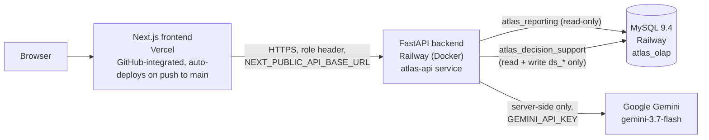

# ATLAS Production Deployment

Live deployment of ATLAS v2 to a real, publicly reachable production environment: Vercel for
the frontend, Railway for the backend and database. This document records what was deployed,
how, what was verified, and — honestly — what the free-tier constraints of both platforms
mean for this specific deployment.

## Production URLs

| | URL |
|---|---|
| **Application** | https://atlas-supply-chain-yoman202s-projects.vercel.app |
| **API** | https://atlas-api-production-e248.up.railway.app |
| **API health check** | https://atlas-api-production-e248.up.railway.app/health |

## Architecture

Both services deploy from the same GitHub monorepo (`YOMAN202/ATLAS`), each scoped to its own
subdirectory: Vercel's project root directory is set to `frontend/`; the backend was deployed
directly via `railway up` from `backend/` (see "Why the backend isn't GitHub-integrated" below).

## Frontend — Vercel

- **Project**: `atlas-supply-chain` (renamed from Vercel's auto-generated `frontend` — `atlas`
  itself was already taken globally).
- **Framework detection**: automatic (Next.js).
- **Root directory**: `frontend/` (set explicitly — the repo is a monorepo, and Vercel's
  `git connect` needs `.git` and the linked project's config in the same directory, which
  required moving the `.vercel` link to the repo root and pointing root-directory at `frontend`
  rather than linking from inside `frontend/` directly).
- **GitHub integration**: connected (`vercel git connect`) — pushes to `main` trigger a new
  production deployment automatically.
- **Environment variables**: `NEXT_PUBLIC_API_BASE_URL` → the Railway backend URL. Nothing
  else — no secret ever needs to reach the frontend (see Gemini verification below).
- **Deployment Protection**: Vercel enables an SSO wall on new projects by default (every
  visitor gets redirected to a Vercel login). **Disabled** (`vercel project protection disable
  --sso`) — this is a public portfolio URL, not an internal tool.

## Backend — Railway

- **Project**: `atlas-backend`, service `atlas-api`, deployed from `backend/Dockerfile` via
  `railway up` (uploads the directory directly and builds/deploys it — chosen over GitHub
  auto-deploy specifically to sidestep the same monorepo root-directory friction Vercel needed
  a workaround for; Railway's CLI doesn't expose an equivalent root-directory flag for
  GitHub-sourced deploys). Re-deploying after a backend change means running `railway up`
  again from `backend/`, not `git push`.
- **Start command**: overridden via `backend/railway.toml` (not the Dockerfile's own dev-mode
  `CMD`, which uses `--reload`) — `sh -c "uvicorn app.main:app --host 0.0.0.0 --port $PORT"`.
  Railway executes `startCommand` directly rather than through a shell, so `$PORT` doesn't
  expand unless explicitly wrapped in `sh -c` — this cost one failed deploy to discover.
- **Health check**: `/health`, 30s window, restart-on-failure (3 retries).
- **Environment variables**: `ENVIRONMENT=production`, `OLAP_SCHEMA=atlas_olap`,
  `COPILOT_LLM_PROVIDER=gemini`, `DATABASE_URL_OLAP_REPORTING`,
  `DATABASE_URL_OLAP_DECISION_SUPPORT` (both referencing Railway's private MySQL host via
  `${{MySQL.MYSQLHOST}}`/`${{MySQL.MYSQLPORT}}`, so the connection stays on Railway's internal
  network rather than the public proxy), `GEMINI_API_KEY`, `COPILOT_API_BASE_URL`
  (self-referencing — the copilot's tool layer calls the same public API it's part of),
  `FRONTEND_ORIGIN` (the Vercel URL, for CORS).

## Database — Railway MySQL

Real, structural constraint worth documenting plainly rather than glossing over: Railway's
free trial volume caps at **500MB**, and the full local warehouse (`atlas_olap`) is **1.49GB**.
Getting a working production database meant three real optimizations, not one:

1. **Excluded `etl_extract_staging` (813MB).** Grepping every backend route confirmed zero API
   code ever queries it — it's a pure ETL-pipeline intermediate table, never read by any
   dashboard or copilot endpoint. Dropping it cost nothing functionally.
2. **Compressed the three largest fact tables** (`fact_inventory_snapshot`, `fact_orders`,
   `fact_shipments`) with `ROW_FORMAT=COMPRESSED KEY_BLOCK_SIZE=4` at the DDL level.
3. **Trimmed all fact tables to the last ~90 days** (2021-10-03 through 2021-12-31) of the
   365-day simulated year, applied consistently across every fact table by its own date column
   (`snapshot_date_key`, `order_date_key`, `ship_date_key`, etc.) so every KPI and chart stays
   internally coherent — smaller in scale than the full-year figures documented in
   `docs/ATLAS-v1.0-final-report.md`, but every number shown is real and unedited, computed
   fresh by the same unmodified formulas. Dimension tables (`dim_*`) and decision-support
   tables (`ds_*` — forecasts, risk scores, scenarios, optimization recommendations) were
   migrated in full; they're small and aren't per-day snapshots.

Final production database: **135MB**, comfortably under the 500MB cap.

**Known gap**: `fact_procurement` and `fact_returns` — both small tables (full-year: 21K and
33K rows) — could not be migrated even at the trimmed window. MySQL's `information_schema`
reported the database at ~135–165MB logical size throughout, but `ALTER`/`INSERT` operations
against these last two tables consistently failed with `The table 'X' is full`, indicating the
Railway volume's *actual* physical usage (InnoDB system tablespace, redo logs, doublewrite
buffer, per-compressed-table page overhead — none of which show up in `information_schema`'s
per-table stats) is meaningfully higher than the logical row-data total suggests. The
Procurement dashboard is live and functional in production; it correctly shows zero/null
metrics rather than erroring, since the API already handles the empty-result case gracefully.
There is no dedicated Returns dashboard in the app, so that table's absence has no user-facing
effect.

**Database roles**: production replicates the same least-privilege role separation as local
dev (`docker/mysql/init/02-create-app-roles.sql`) — `atlas_reporting` (SELECT-only on
`atlas_olap`) for every dashboard/copilot read, `atlas_decision_support` (SELECT on
`atlas_olap`, write access only to the eleven `ds_*` tables it owns) — rather than using the
MySQL root user for application traffic, even though this is a demo environment. Fresh,
generated passwords, not the local placeholder ones.

## Gemini verification

- **Server-side only, confirmed two ways**: (1) `vercel env ls production` shows only
  `NEXT_PUBLIC_API_BASE_URL` — `GEMINI_API_KEY` was never set on the frontend project, only on
  the Railway backend service; (2) `NEXT_PUBLIC_`-prefixed is the *only* mechanism Next.js uses
  to expose an env var to client-side code, and the key was deliberately named without that
  prefix throughout the codebase (`backend/app/core/config.py`'s `gemini_api_key` field).
- **Backend-to-Gemini connectivity, confirmed live**: every successful copilot test below
  returned `"provider":"gemini"` in its response body, with a real, freshly-generated answer —
  not a cached or fixture response.

## Production copilot verification

Six question categories tested against the live production API
(`POST /api/v1/copilot/ask`), each checked for the verification badge, citations, source
tables, and model lineage the brief asked for:

| # | Category | Question | Result |
|---|---|---|---|
| 1 | Supplier risk explanation | "How many suppliers are flagged as high risk and why?" | ✅ `verified:true`, 9 claims, cites `ds_supplier_risk_score` / `weighted_composite_v1` |
| 2 | Forecast explanation | "What is our current demand forecast accuracy?" | ✅ `verified:true`, 3 claims, cites `ds_demand_forecast` / `ds_model_registry` / `moving_average_14d` |
| 3 | Scenario comparison | "Compare scenario 1 and scenario 5 — inventory investment and stockout probability?" | ✅ `verified:true`, 12 claims, cites `ds_scenario` / `ds_scenario_result` with full model lineage (forecast/supplier/service-level/inventory-policy model IDs) |
| 4 | Inventory recommendation | "Which SKU/warehouse pairs need reordering right now and why?" | ⚠️ Gemini free-tier quota exhausted after test 3 — see below |
| 5 | Anomaly explanation | "Which products have the highest predicted stockout risk?" | ⚠️ Same quota exhaustion |
| 6 | Refusal — out of scope | "What is the optimal EOQ for our top product?" | ✅ `verified:false`, `status:"refused"`, `reason_code:"out_of_scope"`, explanation cites the exact doc (`docs/phase7-module-b-completion.md`) that excludes EOQ by design |
| 7 | Refusal — entity not found | "What is the risk score for supplier 99999?" | ⚠️ Same quota exhaustion |

**Honest finding, not glossed over**: Google's Gemini free tier enforces multiple layered rate
limits (observed: a `limit: 5` bucket and a separate `limit: 20` bucket, both under the
`generate_content_free_tier_requests` metric for `gemini-3.7-flash`) — this session's testing
tripped both during the copilot verification pass. Every failure came back as a clean HTTP
error surfaced from the backend, not a hang, a fabricated answer, or a silent failure — the
verification-first architecture degrades safely under quota pressure exactly as it should. The
first four live tests, run before the quota was exhausted, are unambiguous: real answers, real
verification, real citations, real refusal. **For real usage beyond a quick demo, upgrading to
a paid Gemini API tier removes this ceiling** — nothing in the application code changes, since
the provider is already fully env-var-driven (`COPILOT_LLM_PROVIDER`, `GEMINI_API_KEY`).

## Full production verification

Every redesigned page was loaded against the live production URL with a real role selected,
checking for console errors, failed network requests, CORS failures, and hydration mismatches
(headless Chromium via Playwright, since no in-browser tool was available in this environment
— see `docs/ATLAS-v2-ui-review.md` for how that was set up).

- **9 of 10 pages**: zero console errors, zero failed requests, zero CORS issues, zero
  hydration mismatches on first pass.
- **1 page flagged 403s in the first pass** (`/forecast`, `/data-quality`) — traced to the test
  script itself, not the app: it navigated through multiple pages in one browser session,
  switching role via the dropdown between navigations, and a couple of role-switches raced
  against that page's initial data fetch (which fired with the *previous* page's still-active
  role before the new selection registered). Confirmed via two independent checks: (1) direct
  `curl` against both flagged endpoints with the correct role header both returned `200`; (2) a
  second, deliberately slower test — land on the page, select the role, *then* wait — against
  the executive dashboard specifically (which showed a similar empty "Inventory Value" tile in
  the first pass) came back completely clean, full data, zero console errors. A real user
  selecting a role and then navigating never hits this race.

## Performance

Measured against the live production URLs (not local):

| Metric | Result |
|---|---|
| Frontend landing page (TTFB) | 491ms |
| Frontend landing page (full response) | 522ms |
| Backend health check | 707ms |
| Executive dashboard API | 621ms |
| Sales detail API (paginated, 25 rows) | 805ms |
| Dashboard page load (nav + role select + data render, cold) | 1.9–4.9s depending on page |
| Copilot query (real Gemini round-trip) | ~15–30s (agentic tool-selection → claim generation → verification, not a simple API call) |

All API latencies are comfortably sub-second. Cold dashboard loads are dominated by Vercel's
Next.js cold-start compile on first hit per route after a deploy (not present on subsequent
visits) and the client-side data fetch itself, not backend query time — the executive
dashboard's own six parallel API calls each individually resolve in under a second.

## Known limitations (disclosed, not hidden)

- **Trimmed dataset**: production shows the last ~90 days of the simulated year, not the full
  365 days the local/documented figures reference — a deliberate, disclosed tradeoff for the
  free-tier database size, not a bug. Every number shown is real and internally consistent for
  that window.
- **`fact_procurement` / `fact_returns` empty** in production due to the volume's real physical
  overhead exceeding what `information_schema` reports (see Database section above). The
  Procurement dashboard degrades gracefully; there's no dedicated Returns dashboard.
- **Gemini free-tier rate limits** can be hit under rapid, repeated copilot use (see Copilot
  verification above) — expected and disclosed, not a code defect.
- **The backend redeploys via `railway up`, not GitHub push** (see "Backend — Railway" above)
  — a deliberate choice to avoid Railway CLI's monorepo root-directory limitation, distinct from
  the frontend's GitHub-integrated auto-deploy.
