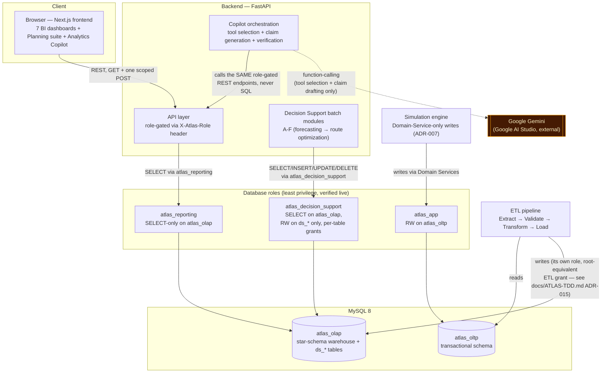
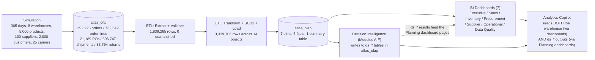
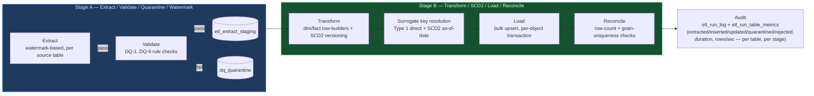

# ATLAS
## Enterprise Supply Chain Intelligence Platform
### Architecture Overview — v1.0

**Status: FINAL — v1.0, 2026-08-14**
*This document supersedes the Phase 0 drafts in `docs/diagrams/system-architecture.md` and `docs/diagrams/etl-flow.md` as the authoritative, current architecture reference. `docs/diagrams/erd.md` (OLTP entity-relationship diagram, Phase 1) and `docs/diagrams/star-schema.md` (OLAP star schema, Phase 4) remain accurate and are referenced, not duplicated, below. Companion document: `docs/ATLAS-v1.0-final-report.md` for the narrative, validated-numbers version of everything shown here as a diagram.*

---

## 1. System architecture

**What this diagram makes explicit that a narrative can't as clearly**: three separate, least-privilege database roles enforce the read/write boundary structurally — verified live at every phase gate by actually attempting a denied write and confirming MySQL rejects it (error 1142), not just by reading the grant configuration. The only component with any external network dependency is the copilot's tool-selection/claim-drafting step, which talks to Google's Gemini API — and even that dependency is scoped to *proposing* claims, never to retrieving or computing anything; Gemini never receives a database credential and never touches `atlas_oltp` or `atlas_olap` directly.

## 2. Data flow — simulation to decision intelligence

Every arrow in this diagram is a real, measured pipeline stage — see `docs/ATLAS-v1.0-final-report.md` §2–§13 for the validated numbers behind each one, and §15 for the runtime of each stage.

## 3. Warehouse star schema

Full entity-relationship diagram, fact grains, and design rationale: **`docs/diagrams/star-schema.md`** (unchanged since Phase 4, validated against the implemented DDL). Summary: 7 conformed dimensions (`dim_date`, `dim_region`, `dim_product`, `dim_supplier`, `dim_warehouse`, `dim_carrier`, `dim_customer`), 6 fact tables at Kimball-conformed grains (`fact_orders`, `fact_shipments`, `fact_inventory_snapshot`, `fact_procurement`, `fact_supplier_delivery`, `fact_returns`), 1 summary table (`summary_daily_revenue_by_region`). SCD2 (`effective_from`/`effective_to`/`is_current`) on `dim_supplier`/`dim_warehouse` only, ETL-enforced per ADR-012 (MySQL 8 has no native temporal-table support).

## 4. ETL pipeline

**Real, measured throughput** (full run against the validated 365-day dataset): Stage A extracted 1,839,265 rows in 3,076s with 0 quarantined; Stage B loaded 3,339,706 rows across all 14 warehouse objects in 1,476s. A no-change rerun of Stage A completes in 2.1s (from 3,076s) — the literal, measured proof that watermark advancement only commits past durably-staged data (ADR-017). Full detail, including the three real bugs found and fixed against production-scale data: `docs/phase5-stage-a-completion.md`, `docs/phase5-stage-b-completion.md`.

## 5. Copilot verification pipeline

Full diagram, with the verification boundary highlighted explicitly and every node mapped to real code: **`docs/phase8-copilot-architecture-diagram.md`**. Summary: `User → Chat UI → Tool selection (Gemini) → Read-only analytics API → Warehouse → Claim generation (Gemini) → [Deterministic verification → Refusal decision → Verified rendering] → User`. Everything from claim generation onward runs through the same unmodified `verify_claims`/`decide_refusal`/`render` functions the 50-test CI-blocking harness proves independently of any LLM.

---

## 6. Why three diagrams live in `docs/diagrams/` and this file coexist

`docs/diagrams/erd.md` (OLTP, Phase 1) and `docs/diagrams/star-schema.md` (OLAP, Phase 4) were each finalized at their own phase gate against the actual implemented schema and have not needed to change since — they remain accurate and are referenced above rather than redrawn. `docs/diagrams/system-architecture.md` and `docs/diagrams/etl-flow.md` were Phase 0 drafts (the former still names Power BI, which the platform never actually used, and neither reflects the decision-support modules or the copilot) — this file's §1 and §4 supersede them as the current, accurate versions; the two stale files are left in place as historical record rather than deleted, each now carrying a pointer to this document.
