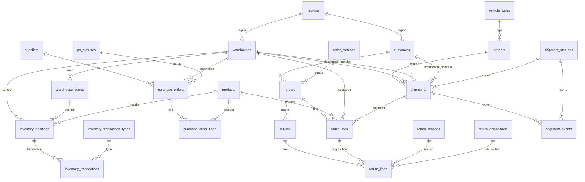

# Entity-Relationship Diagram — OLTP Schema (DOC-1)

**Status:** Finalized to match the schema implemented in Phase 1
(`backend/app/models/`, migrations `3518b4c8151c` → `cd15da4c273a`).
Column-level detail (types, constraints, business meaning) lives in
[`docs/data-dictionary.md`](../data-dictionary.md); this diagram shows
structure and relationships.

## Notes on relationships not expressible as a plain FK

- `inventory_transactions.source_reference_type` / `source_reference_id`
  is a polymorphic soft-reference (to a PO line, order line, return line,
  or transfer) — not shown above, since MySQL cannot express a single FK
  across multiple target tables. Documented exception to full DB-level FK
  enforcement (ADR-002); see `docs/data-dictionary.md`.
- `shipments` carries **either** `destination_warehouse_id` **or**
  `destination_customer_id` (never both, never neither), enforced by a
  CHECK constraint — modeling both inter-warehouse transfers (FR-2.3) and
  customer deliveries (FR-3.2) in the one `shipments` table TDD §4.1 names.

## 3NF justification

Every table is in 3NF (NFR-1): all non-key attributes depend on the whole
key, and on nothing but the key. The one deliberate denormalization is
price/cost snapshotting — `purchase_order_lines.unit_cost` and
`order_lines.unit_price`/`unit_cost` duplicate a value also present on
`products`, by design: a transaction line records the price *at the time
of the transaction*, not a live join to the product's current price, so
historical revenue/margin/spend figures don't shift retroactively when a
product's price changes. This is a standard, documented OLTP pattern, not
an oversight.
