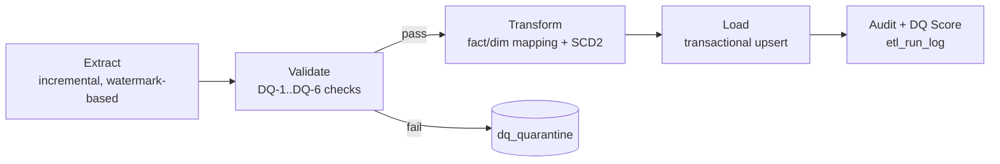

# ETL Flow Diagram (DOC-3)

**Status:** Initial version, committed in Phase 0 from `docs/ATLAS-TDD.md`
§6. Finalized in Phase 5, alongside the implemented pipeline.

Stage A (Extract + Validate/DQ + Audit), with its full data-quality test
suite, is built and proven **before** Stage B (Transform + SCD2 + Load +
Score) — see Master Prompt §8 and Roadmap Phase 5.
