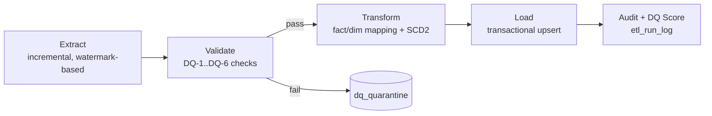

# ETL Flow Diagram (DOC-3)

**Status: SUPERSEDED by `docs/architecture-overview.md` §4 (v1.0, 2026-08-14),**
which shows the same shape with the real, measured throughput numbers from
the actual Stage A/B implementation. This file's flow shape is still
directionally accurate but was never updated past its Phase 0 draft
despite the note below claiming finalization — kept as historical record.

*Original status note, preserved: initial version, committed in Phase 0
from `docs/ATLAS-TDD.md` §6; intended to be finalized in Phase 5 alongside
the implemented pipeline.*

```mermaid
flowchart LR
    A[Extract\nincremental, watermark-based] --> B[Validate\nDQ-1..DQ-6 checks]
    B -->|pass| C[Transform\nfact/dim mapping + SCD2]
    B -->|fail| Q[(dq_quarantine)]
    C --> D[Load\ntransactional upsert]
    D --> E[Audit + DQ Score\netl_run_log]
```

Stage A (Extract + Validate/DQ + Audit), with its full data-quality test
suite, is built and proven **before** Stage B (Transform + SCD2 + Load +
Score) — see Master Prompt §8 and Roadmap Phase 5.
