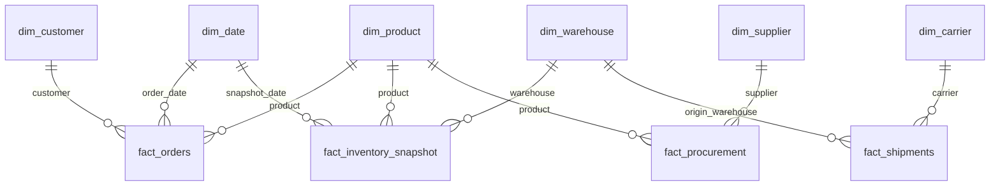

# Star Schema Diagram — OLAP Warehouse (DOC-2)

**Status:** Initial version, committed in Phase 0 from `docs/ATLAS-TDD.md`
§4.2. This is a draft to design against — the **grain/schema review gate
at the end of Phase 4** is where it is validated against the implemented
DDL and finalized.

## Fact grains (TDD §4.2, not to be mixed)

| Fact table | Grain |
|---|---|
| `fact_orders` | Order line |
| `fact_shipments` | Shipment |
| `fact_inventory_snapshot` | SKU × warehouse × day |
| `fact_procurement` | PO line |
| `fact_supplier_delivery` | Delivery event |
| `fact_returns` | Return line |

## Conformed dimensions

`dim_date`, `dim_product`, `dim_supplier` (SCD2), `dim_warehouse` (SCD2),
`dim_carrier`, `dim_customer`, `dim_region`. SCD2 applies **only** to
supplier and warehouse (ADR-006) — all others are Type 1.

Built in **Phase 4**, after the OLTP schema (Phase 1) it derives from.
