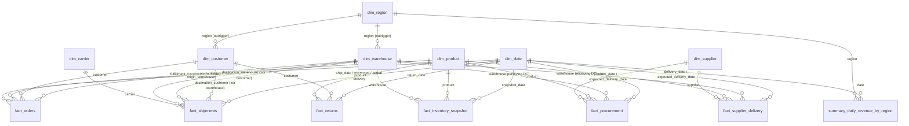

# Star Schema Diagram — OLAP Warehouse (DOC-2)

**Status:** Finalized at the Phase 4 grain/schema review gate, validated
against the implemented DDL in `etl/warehouse_ddl/`. Supersedes the
Phase-0 draft (`docs/ATLAS-TDD.md` §4.2).

```mermaid
erDiagram
    dim_date ||--o{ fact_orders : "order_date"
    dim_product ||--o{ fact_orders : "product"
    dim_customer ||--o{ fact_orders : "customer"
    dim_warehouse ||--o{ fact_orders : "fulfillment_warehouse (nullable)"

    dim_carrier ||--o{ fact_shipments : "carrier"
    dim_warehouse ||--o{ fact_shipments : "origin_warehouse"
    dim_warehouse ||--o{ fact_shipments : "destination_warehouse (xor customer)"
    dim_customer ||--o{ fact_shipments : "destination_customer (xor warehouse)"
    dim_date ||--o{ fact_shipments : "ship_date / estimated / actual delivery"

    dim_warehouse ||--o{ fact_inventory_snapshot : "warehouse"
    dim_product ||--o{ fact_inventory_snapshot : "product"
    dim_date ||--o{ fact_inventory_snapshot : "snapshot_date"

    dim_supplier ||--o{ fact_procurement : "supplier"
    dim_product ||--o{ fact_procurement : "product"
    dim_warehouse ||--o{ fact_procurement : "warehouse (receiving DC)"
    dim_date ||--o{ fact_procurement : "order_date / expected_delivery_date"

    dim_supplier ||--o{ fact_supplier_delivery : "supplier"
    dim_product ||--o{ fact_supplier_delivery : "product"
    dim_warehouse ||--o{ fact_supplier_delivery : "warehouse (receiving DC)"
    dim_date ||--o{ fact_supplier_delivery : "delivery_date / expected_delivery_date"

    dim_product ||--o{ fact_returns : "product"
    dim_customer ||--o{ fact_returns : "customer"
    dim_date ||--o{ fact_returns : "return_date"

    dim_region ||--o{ dim_customer : "region (outrigger)"
    dim_region ||--o{ dim_warehouse : "region (outrigger)"

    dim_region ||--o{ summary_daily_revenue_by_region : "region"
    dim_date ||--o{ summary_daily_revenue_by_region : "date"
```

Relationships beyond TDD §4.2's original diagram (`fulfillment_warehouse`
on `fact_orders`; `warehouse` on `fact_procurement`; every relationship on
`fact_supplier_delivery` and `fact_returns`) are additions grounded in
real OLTP source columns, per the TDD's own "representative, not
exhaustive" framing (§4.2) — see ADR-013 (`docs/ATLAS-TDD.md` §14) for
the `fact_supplier_delivery`/`fact_returns` design rationale.

## Fact grains (TDD §4.2.1; stated explicitly per the Phase 4 review requirement)

| Fact table | Grain | Idempotency/grain key |
|---|---|---|
| `fact_orders` | One row per order line | `source_order_line_id` |
| `fact_shipments` | One row per shipment | `source_shipment_id` |
| `fact_inventory_snapshot` | **One row per product, per warehouse, per snapshot date** — not per zone, not per position, not per transaction | `(product_key, warehouse_key, snapshot_date_key)` |
| `fact_procurement` | One row per purchase-order line — **the purchase-order event** (what was ordered) | `source_po_line_id` |
| `fact_supplier_delivery` | One row per delivery event — **the receipt/delivery event** (what arrived); only exists once a `fact_procurement` line has actually been received | `source_po_line_id` (same source row as `fact_procurement`, see ADR-013) |
| `fact_returns` | One row per return line | `source_return_line_id` |

`fact_procurement` and `fact_supplier_delivery` are both sourced from
`atlas_oltp.purchase_order_lines` — there is no separate OLTP
delivery-event table. They represent two distinct business processes
(ordering vs. receiving) over the same underlying rows, which is
Kimball-legitimate but easy to misread from the TDD's "distinct grains"
language alone; see ADR-013 for the full statement.

## Conformed dimensions

`dim_date`, `dim_product`, `dim_supplier` (**SCD2**), `dim_warehouse`
(**SCD2**), `dim_carrier`, `dim_customer`, `dim_region`. SCD2 applies
**only** to supplier and warehouse (ADR-006) — all others are Type 1.

Every dimension has a Kimball surrogate key (`<dim>_key`,
`AUTO_INCREMENT`, distinct from the OLTP `id`) — ADR-011. `dim_supplier`
and `dim_warehouse` additionally carry `effective_from` / `effective_to`
/ `is_current` (ADR-012); the OLTP `id` intentionally repeats across
their version rows. `dim_region` is a small conformed "outrigger" —
reached only through `dim_customer`/`dim_warehouse`, not linked to any
fact directly, since region is not itself a fact attribute in the OLTP
source.

## Summary tables

`summary_daily_revenue_by_region` — the one table TDD §10 names by
example. Physical table (not a view, per TDD §15), empty shell built in
Phase 4, populated by Phase 5's ETL. The entire Phase 4 summary-table
deliverable — no others are built speculatively.

## Not implemented in Phase 4 (deferred, not omitted by oversight)

- Covering indexes — deferred to Phase 7, once real dashboard query
  patterns exist (TDD §4.3).
- Date-partitioning of `fact_inventory_snapshot` — TDD §10 calls this
  optional "if row counts warrant it"; the actual Phase 3 dataset (365
  days, `docs/phase3-validation.md`) doesn't yet approach the volume the
  TDD's original 5-year assumption anticipated. See ADR-014.

Built in **Phase 4**, after the OLTP schema (Phase 1) it derives from,
and the validated 365-day Phase 3 dataset it was designed against.
