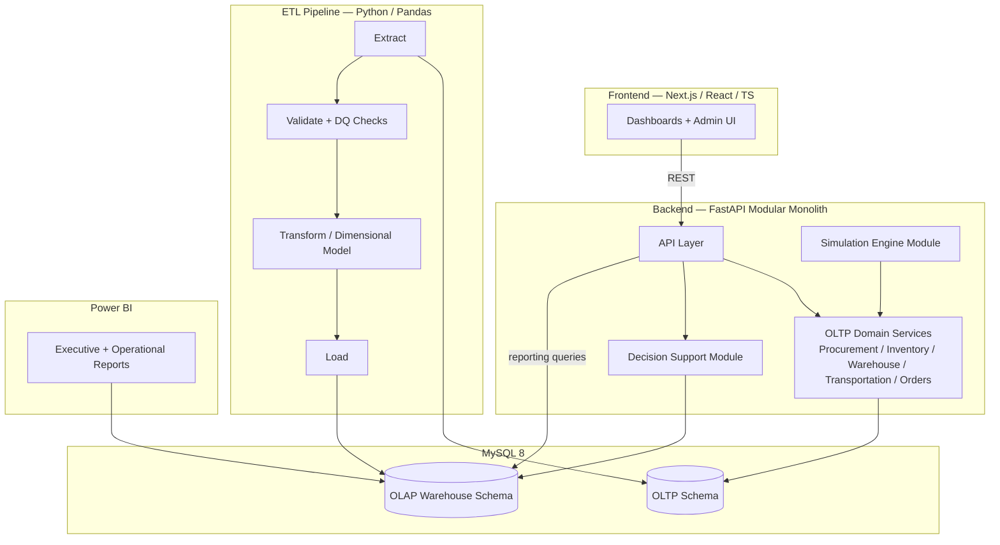

# System Architecture Diagram (DOC-4)

**Status:** Initial version, committed in Phase 0. Source of truth for the
architecture itself is `docs/ATLAS-TDD.md` §2 — this diagram is kept in
sync with it as components are built; finalized in Phase 10.

**Phase 0 status:** MySQL, an empty FastAPI backend, and an empty Next.js
frontend are running via `docker compose up`. Every other box (Domain
Services, Simulation Engine, ETL, Decision Support, Power BI) is built in
its designated Roadmap phase — see `docs/ATLAS-Roadmap.md`.
