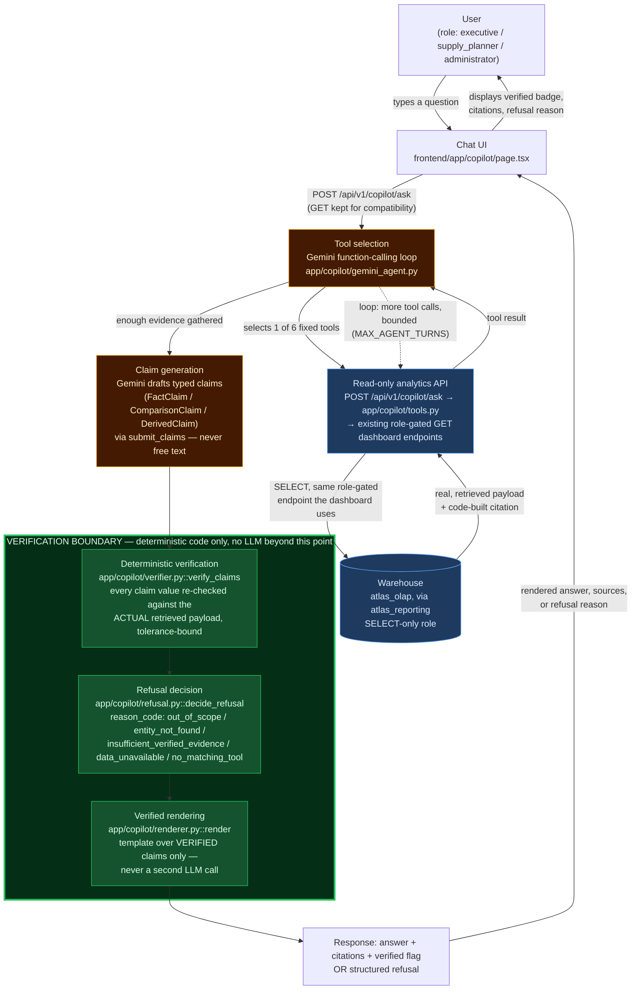

# ATLAS
## Enterprise Supply Chain Intelligence Platform
### Analytics Copilot — Final Pipeline Architecture Diagram

**Status: FINAL — v1.0, 2026-08-14**
*Companion to `docs/phase8-analytics-copilot.md`, `docs/phase8-grounding-spec.md`, `docs/phase8-chat-interface-completion.md`, `docs/phase8-gemini-provider-notes.md`. This document is the single authoritative picture of the copilot's request pipeline as shipped in ATLAS v1.0.*

---

## 1. The pipeline

## 2. Reading the diagram

**Amber boxes (Tool selection, Claim generation) — LLM-influenced, non-deterministic.** This is the only part of the pipeline where Gemini's output isn't pre-determined: which of the six fixed tools to call, and what claims to draft from what it retrieved. Nothing here is trusted on its own — every claim that comes out of this stage is a *proposal*, not a fact, until it crosses the verification boundary.

**Blue boxes (Read-only analytics API, Warehouse) — the same trust boundary every dashboard already uses.** The copilot holds no database credential of its own and generates no SQL. It calls back into this same backend over HTTP, through the identical role-gated `GET` dashboard endpoints (`/api/v1/dashboards/...`) the Next.js frontend already calls — inheriting `atlas_reporting`'s `SELECT`-only grant on `atlas_olap`. A question the caller's role can't see data for fails at this exact boundary (403/empty result), the same way the dashboard UI would hide or reject that page.

**Green boxes (the Verification Boundary) — deterministic code, zero LLM involvement.** This is the load-bearing part of the whole design, and the reason it's drawn as its own bounded region rather than three more pipeline steps:

1. **Deterministic verification** (`verify_claims`) re-checks every claim's numeric value against the *actual* retrieved payload (not what Gemini said it retrieved) — exact match, or a bounded tolerance for legitimate derived arithmetic (a difference, sum, or percentage delta recomputed from real operands). A claim citing a citation ID that was never actually retrieved fails here too, regardless of whether its number happens to be right.
2. **Refusal decision** (`decide_refusal`) turns "zero or too few verified claims survived" into a structured, typed refusal — never free-text "I don't know" — with a specific `reason_code` the eval harness can assert on deterministically.
3. **Verified rendering** (`render`) builds the final answer from a template over *only* the claims that survived step 1. This is the actual enforcement point for "no numeric value may appear in the final response unless it originates from a verified claim" — claims are filtered here by construction, not by convention upstream, and it is deliberately **not** a second LLM call (re-generating prose would reopen exactly the hallucination risk this boundary exists to close).

**This is the one boundary in the whole pipeline that is identical regardless of which LLM provider sits upstream of it.** Gemini replaced the originally-scoped Anthropic client (ADR-024) without a single line of `verifier.py`, `refusal.py`, or `renderer.py` changing — proof, not just a design claim, that the verification boundary is genuinely provider-agnostic.

## 3. What crosses the boundary, and what doesn't

| Crosses into the verification boundary | Never crosses (or never reaches this pipeline at all) |
|---|---|
| A typed claim (`FactClaim`/`ComparisonClaim`/`DerivedClaim`) with a `citation_id` | Free-form prose asserting a number |
| A citation ID referencing a tool call actually made this conversation | An invented or plausible-sounding source |
| Legitimate arithmetic (difference/sum/pct_delta) over two retrieved operands | A number with no retrieved operand behind it |
| — | Any write operation (no `INSERT`/`UPDATE`/`DELETE` path exists anywhere the copilot can reach) |
| — | SQL of any kind (the copilot never generates or executes a query — see `docs/phase8-analytics-copilot.md` §3) |
| — | Out-of-scope requests (EOQ, executive-briefing generation, live scenario submission) — caught by `check_out_of_scope` before any tool call is made at all |

## 4. Mapping to real code, end to end

| Diagram node | Real module / function |
|---|---|
| Chat UI | `frontend/app/copilot/page.tsx` |
| (transport) | `POST /api/v1/copilot/ask` (primary) / `GET /api/v1/copilot/ask` (compatibility) — `backend/app/api/v1/copilot.py` |
| Tool selection | `app/copilot/gemini_agent.py::run_agentic_pipeline` (Gemini Interactions API function-calling loop) |
| Read-only analytics API | `app/copilot/tools.py` (six tool wrappers) → existing `GET /api/v1/dashboards/...` routers |
| Warehouse | `atlas_olap`, queried only via the `atlas_reporting` role |
| Claim generation | Gemini's `submit_claims` function call, parsed by `gemini_agent.py::_claim_from_dict` |
| Deterministic verification | `app/copilot/verifier.py::verify_claims` |
| Refusal decision | `app/copilot/refusal.py::decide_refusal` / `check_out_of_scope` |
| Verified rendering | `app/copilot/renderer.py::render` |

Every function to the right of "Claim generation" in that table is the same, unmodified code exercised by the 50-test CI-blocking harness in `backend/tests/copilot/` — proven correct against synthetic, deliberately-adversarial fixtures before this diagram's Gemini-specific left half ever ran against a live model.
